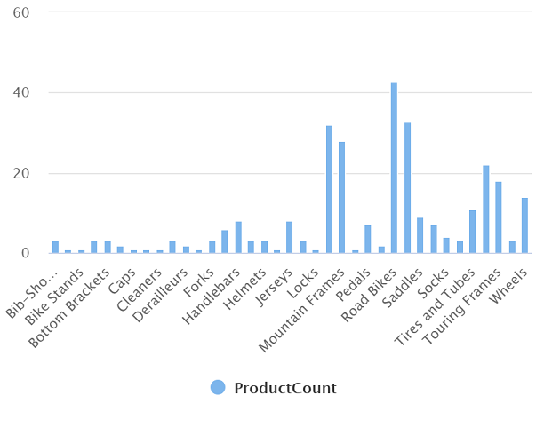
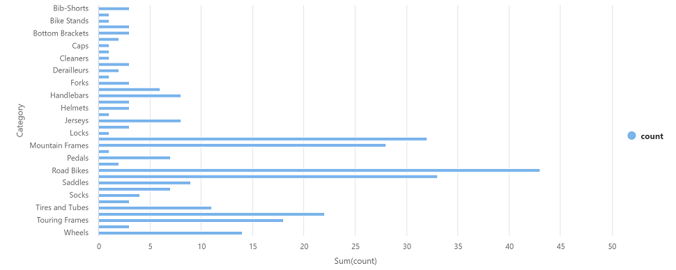

---
lab:
  title: Explorer Azure Synapse Analytics
  ilt-use: Lab
---

# Explorer Azure Synapse Analytics

Azure Synapse Analytics fournit une plateforme d’analytique des données unique et consolidée pour l’analytique des données de bout en bout. Dans cet exercice, vous allez explorer différentes façons d’ingérer et d’explorer les données. Cet exercice est conçu comme une vue d’ensemble générale des différentes fonctionnalités principales d’Azure Synapse Analytics. D’autres exercices sont disponibles pour explorer en détail des fonctionnalités spécifiques.

Cet exercice devrait prendre environ **60** minutes.

## Avant de commencer

Vous avez besoin d’un [abonnement Azure](https://azure.microsoft.com/free) dans lequel vous avez un accès administratif.

## Provisionner un espace de travail Azure Synapse Analytics

Un *espace de travail* Azure Synapse Analytics constitue un point central pour la gestion des données et des temps d’exécution du traitement des données. Vous pouvez mettre à disposition un espace de travail à l’aide de l’interface interactive du portail Azure, ou vous pouvez déployer un espace de travail et les ressources qu’il contient à l’aide d’un script ou d’un modèle. Dans la plupart des scénarios de production, il est préférable d’automatiser la mise à disposition à l’aide de scripts et de modèles afin d’intégrer le déploiement des ressources dans un processus de développement et d’opérations reproductibles (*DevOps*).

Dans cet exercice, vous allez utiliser une combinaison d’un script PowerShell et d’un modèle ARM pour approvisionner Azure Synapse Analytics.

1. Dans un navigateur web, connectez-vous au [portail Azure](https://portal.azure.com) à l’adresse `https://portal.azure.com`.
2. Utilisez le bouton **[\>_]** à droite de la barre de recherche, en haut de la page, pour créer un environnement Cloud Shell dans le portail Azure, en sélectionnant un environnement ***PowerShell*** et en créant le stockage si vous y êtes invité. Cloud Shell fournit une interface de ligne de commande dans un volet situé en bas du portail Azure, comme illustré ici :

    

    > **Remarque** : si vous avez créé un shell cloud qui utilise un environnement *Bash*, utilisez le menu déroulant en haut à gauche du volet Cloud Shell pour le remplacer par ***PowerShell***.

3. Notez que vous pouvez redimensionner le volet Cloud Shell en faisant glisser la barre de séparation en haut du volet. Vous pouvez aussi utiliser les icônes **&#8212;** , **&#9723;** et **X** situées en haut à droite du volet pour réduire, agrandir et fermer le volet. Pour plus d’informations sur l’utilisation d’Azure Cloud Shell, consultez la [documentation Azure Cloud Shell](https://docs.microsoft.com/azure/cloud-shell/overview).

4. Dans le volet PowerShell, entrez les commandes suivantes pour cloner ce référentiel :

    ```
    rm -r dp-203 -f
    git clone https://github.com/MicrosoftLearning/dp-203-azure-data-engineer dp-203
    ```

5. Une fois que le référentiel a été cloné, entrez les commandes suivantes pour accéder au dossier de cet exercice et exécutez le script **setup.ps1** qu’il contient :

    ```
    cd dp-203/Allfiles/labs/01
    ./setup.ps1
    ```

6. Si vous y êtes invité, choisissez l’abonnement à utiliser (uniquement si vous avez accès à plusieurs abonnements Azure).
7. Quand vous y êtes invité, entrez un mot de passe approprié à définir pour votre pool Azure Synapse SQL.

    > **Remarque** : veillez à mémoriser ce mot de passe. En outre, le mot de passe ne doit pas contenir l’ensemble ou une partie du nom de connexion.

8. Attendez que le script se termine. Cette opération prend généralement environ 20 minutes, mais dans certains cas, elle peut être plus longue. Pendant que vous attendez, consultez l’article [Qu’est-ce qu’Azure Synapse Analytics ?](https://docs.microsoft.com/azure/synapse-analytics/overview-what-is) dans la documentation Azure Synapse Analytics.

## Explorer Synapse Studio

*Synapse Studio* est un portail web qui vous permet de gérer et d’utiliser les ressources de votre espace de travail Azure Synapse Analytics.

1. Une fois l’exécution du script d’installation terminée, dans le portail Azure, accédez au groupe de ressources **dp203-*xxxxxxx*** qu’il a créé et notez que ce groupe de ressources contient votre espace de travail Synapse, un compte Stockage pour votre lac de données, un pool Apache Spark, un pool Data Explorer et un pool SQL dédié.
2. Sélectionnez votre espace de travail Synapse et, dans sa page **Vue d’ensemble**, dans la carte **Ouvrir Synapse Studio**, sélectionnez **Ouvrir** pour ouvrir Synapse Studio dans un nouvel onglet de navigateur. Synapse Studio est une interface web que vous pouvez utiliser pour travailler avec votre espace de travail Synapse Analytics.
3. Sur le côté gauche de Synapse Studio, utilisez l'icône **&rsaquo;&rsaquo;** pour développer le menu. Cela révèle les différentes pages de Synapse Studio que vous allez utiliser pour gérer les ressources et effectuer les tâches d’analyse des données, comme illustré ici :

    

4. Affichez la page **Données** et notez qu’elle contient deux onglets contenant des sources de données :
    - Un onglet **Espace de travail** contenant les bases de données définies dans l’espace de travail (y compris les bases de données SQL dédiées et les bases de données Data Explorer)
    - Un onglet **Lié** contenant les sources de données liées à l’espace de travail, notamment Azure Data Lake Storage.

5. Affichez la page **Développer**, qui est actuellement vide. Il s’agit de l’endroit où vous pouvez définir des scripts et d’autres ressources servant à développer des solutions de traitement des données.
6. Affichez la page **Intégrer**, qui est également vide. Vous utilisez cette page pour gérer les ressources d’ingestion et d’intégration des données, telles que les pipelines pour transférer et transformer des données entre des sources de données.
7. Affichez la page **Superviser**. Vous pouvez y observer les travaux de traitement des données au fur et à mesure de leur exécution et afficher leur historique.
8. Affichez la page **Gérer**. Vous pouvez y gérer les pools, les exécutions et d’autres ressources utilisées dans votre espace de travail Azure Synapse. Affichez chacun des onglets de la section **Pools Analytics** et notez que votre espace de travail inclut les pools suivants :
    - **Pools SQL** :
        - **Intégré** : pool SQL *serverless* que vous pouvez utiliser à la demande pour explorer ou traiter des données dans un lac de données à l’aide de commandes SQL.
        - **sql*xxxxxxx*** : pool SQL *dédié* qui héberge une base de données d’entrepôt de données relationnelle.
    - **Pools Apache Spark** :
        - **spark*xxxxxxx*** : pool que vous pouvez utiliser à la demande pour explorer ou traiter des données dans un lac de données à l’aide de langages de programmation tels que Scala ou Python.

## Ingérer des données avec un pipeline

L’une des tâches clés que vous pouvez effectuer avec Azure Synapse Analytics consiste à définir des *pipelines* qui transfèrent (et, le cas échéant, transforment) des données à partir d’un large éventail de sources vers votre espace de travail à des fins d’analyse.

### Utiliser la tâche Copier des données pour créer un pipeline

1. Dans Synapse Studio, sur la **page d'accueil**, sélectionnez **Ingérer** pour ouvrir l’outil **Copier des données**
2. Dans l’outil Copier des données, à l’étape **Propriétés**, assurez-vous que les options **Tâche de copie intégrée** et **Exécuter une fois maintenant** sont sélectionnées, puis cliquez sur **Suivant >**.
3. À l’étape **Source**, dans la sous-étape **Jeu de données**, sélectionnez les paramètres suivants :
    - **Type de source** : Tous
    - **Connexion** : *créez une connexion et, dans le volet **Service lié** qui s’affiche, sous l’onglet **Protocole générique**, sélectionnez **HTTP**. Ensuite, créez une connexion à un fichier de données à l’aide des paramètres suivants :*
        - **Nom** : Produits
        - **Description** : Liste de produits via HTTP
        - **Se connecter via un runtime d'intégration** : AutoResolveIntegrationRuntime
        - **URL de base** : `https://raw.githubusercontent.com/MicrosoftLearning/dp-203-azure-data-engineer/master/Allfiles/labs/01/adventureworks/products.csv`
        - **Validation du certificat de serveur** : Activer
        - **Type d’authentification** : Anonyme
4. Une fois la connexion créée, dans la page **Magasin de données source**, vérifiez que les paramètres suivants sont activés, puis sélectionnez **Suivant >**  :
    - **URL relative** : *Laissez vide*
    - **Méthode de demande** : GET
    - **En-têtes supplémentaires** : *Laissez vide*
    - **Copie binaire** : <u>Non</u> sélectionné
    - **Expiration du délai de la demande** : *Laissez vide*
    - **Nombre maximal de connexions simultanées** : *Laisser vide*
5. À l’étape **Source**, dans la sous-étape **Configuration**, sélectionnez **Aperçu des données** pour afficher un aperçu des données du produit que votre pipeline va recevoir, puis fermez l’aperçu.
6. Après avoir affiché un aperçu des données, sur la page **Paramètres de format de fichier**, assurez-vous que les paramètres suivants sont activés, puis sélectionnez **Suivant >**  :
    - **Format de fichier** : DelimitedText
    - **Séparateur de colonne** : virgule (,)
    - **Délimiteur de lignes** : Saut de ligne (\n)
    - **Première ligne comme en-tête** : Sélectionné
    - **Type de compression** : Aucune
7. À l’étape **Destination**, dans la sous-étape **Jeu de données**, sélectionnez les paramètres suivants :
    - **Type de destination** : Azure Data Lake Storage Gen 2
    - **Connexion** : *sélectionnez la connexion existante à votre magasin de lac de données (cela a été créé pour vous lorsque vous avez créé l’espace de travail).*
8. Une fois la connexion sélectionnée, à l’étape **Destination/Jeu de données**, vérifiez que les paramètres suivants sont sélectionnés, puis sélectionnez **Suivant >**  :
    - **Chemin d’accès au dossier** : files/product_data
    - **Nom du fichier** : products.csv
    - **Comportement de copie** : Aucun
    - **Nombre maximal de connexions simultanées** : *Laisser vide*
    - **Taille de bloc (Mo)** : *Laissez vide*
9. À l’étape **Destination**, dans la sous-étape **Configuration** de la page **Paramètres de format de fichier**, assurez-vous que les propriétés suivantes sont sélectionnées. Ensuite, sélectionnez **Suivant >**  :
    - **Format de fichier** : DelimitedText
    - **Séparateur de colonne** : virgule (,)
    - **Délimiteur de lignes** : Saut de ligne (\n)
    - **Ajouter un en-tête au fichier** : Sélectionné
    - **Type de compression** : Aucune
    - **Nombre maximal de lignes par fichier** : *Laissez vide*
    - **Préfixe du nom de fichier** : *Laissez vide*
10. À l’étape **Paramètres**, entrez les paramètres suivants, puis cliquez sur **Suivant >** :
    - **Nom de la tâche** : Copier les produits
    - **Description de la tâche** : Copie des données des produits
    - **Tolérance de panne** : *Laissez vide*
    - **Activer la journalisation** : <u>Non</u> sélectionné
    - **Activer le mode de préproduction** : <u>Non</u> sélectionné
11. À l’étape **Vérifier et terminer**, à la sous-étape **Vérifier**, lisez le résumé, puis cliquez sur **Suivant >**.
12. À l’étape **Déploiement**, attendez que le pipeline soit déployé, puis cliquez sur **Terminer**.
13. Dans Synapse Studio, sélectionnez la page **Superviser**, puis sous l’onglet **Exécutions du pipeline**, attendez que le pipeline **Copier les produits** se termine avec l’état **Réussi** (vous pouvez utiliser le bouton **&#8635; Actualiser** dans la page Exécutions du pipeline pour actualiser l’état).
14. Affichez la page **Intégrer** et vérifiez qu’elle contient désormais un pipeline nommé **Copier les produits**.

### Afficher les données ingérées

1. Dans la page **Données**, sélectionnez l’onglet **Lié** et développez la hiérarchie de conteneurs **synapse*xxxxxxx* (Primary) datalake** jusqu’à ce que vous voyiez le stockage de fichiers **files** de votre espace de travail Synapse. Sélectionnez ensuite le stockage de fichiers pour vérifier qu’un dossier nommé **products.data** contenant un fichier nommé **products.csv** a été copié à cet emplacement, comme illustré ici :

    

2. Cliquez avec le bouton droit sur le fichier de données **products.csv** et sélectionnez **Aperçu** pour afficher les données ingérées. Fermez ensuite l’aperçu.

## Utiliser un pool SQL serverless pour analyser les données

Maintenant que vous avez ingéré des données dans votre espace de travail, vous pouvez utiliser Synapse Analytics pour les interroger et les analyser. L’une des méthodes les plus courantes pour interroger des données consiste à utiliser SQL, et dans Synapse Analytics, vous pouvez utiliser un pool SQL pour exécuter du code SQL sur des données dans un lac de données.

1. Dans Synapse Studio, cliquez avec le bouton droit sur le fichier **products.csv** dans le stockage de fichiers de votre espace de travail Synapse, pointez sur **Nouveau script SQL**, puis choisissez **Sélectionner les 100 premières lignes**.
2. Dans le volet **Script SQL 1** qui s’ouvre, passez en revue le code SQL qui a été généré, et qui doit ressembler à ceci :

    ```SQL
    -- This is auto-generated code
    SELECT
        TOP 100 *
    FROM
        OPENROWSET(
            BULK 'https://datalakexxxxxxx.dfs.core.windows.net/files/product_data/products.csv',
            FORMAT = 'CSV',
            PARSER_VERSION='2.0'
        ) AS [result]
    ```

    Ce code ouvre un ensemble de lignes à partir du fichier texte que vous avez importé et récupère les 100 premières lignes de données.

3. Dans la liste **Se connecter à**, vérifiez que l’option **Intégré** est cochée : cela représente le pool SQL intégré qui a été créé avec votre espace de travail.
4. Dans la barre d’outils, utilisez le bouton **&#9655; Exécuter** pour exécuter le code SQL, puis passez en revue les résultats, qui doivent ressembler à ceci :

    | C1 | C2 | C3 | C4 |
    | -- | -- | -- | -- |
    | ProductID | ProductName | Catégorie | ListPrice |
    | 771 | Mountain-100 Silver, 38 | VTT | 3399.9900 |
    | 772 | Mountain-100 Silver, 42 | VTT | 3399.9900 |
    | ... | ... | ... | ... |

5. Notez que les résultats se composent de quatre colonnes nommées C1, C2, C3 et C4, et que la première ligne dans les résultats contient les noms des champs de données. Pour résoudre ce problème, ajoutez des paramètres HEADER_ROW = TRUE à la fonction OPENROWSET comme indiqué ici (en remplaçant *datalakexxxxxxx* par le nom de votre compte de stockage de lac de données), puis réexécutez la requête :

    ```SQL
    SELECT
        TOP 100 *
    FROM
        OPENROWSET(
            BULK 'https://datalakexxxxxxx.dfs.core.windows.net/files/product_data/products.csv',
            FORMAT = 'CSV',
            PARSER_VERSION='2.0',
            HEADER_ROW = TRUE
        ) AS [result]
    ```

    À présent, les résultats ressemblent à ceci :

    | ProductID | ProductName | Catégorie | ListPrice |
    | -- | -- | -- | -- |
    | 771 | Mountain-100 Silver, 38 | VTT | 3399.9900 |
    | 772 | Mountain-100 Silver, 42 | VTT | 3399.9900 |
    | ... | ... | ... | ... |

6. Modifiez la requête comme suit (en remplaçant *datalakexxxxxxx* par le nom de votre compte de stockage de lac de données) :

    ```SQL
    SELECT
        Category, COUNT(*) AS ProductCount
    FROM
        OPENROWSET(
            BULK 'https://datalakexxxxxxx.dfs.core.windows.net/files/product_data/products.csv',
            FORMAT = 'CSV',
            PARSER_VERSION='2.0',
            HEADER_ROW = TRUE
        ) AS [result]
    GROUP BY Category;
    ```

7. Exécutez la requête modifiée, qui doit retourner un jeu de résultats contenant le nombre de produits dans chaque catégorie, comme ceci :

    | Catégorie | ProductCount |
    | -- | -- |
    | Bib Shorts | 3 |
    | Porte-vélos | 1 |
    | ... | ... |

8. Dans le volet **Propriétés** de **Script SQL 1**, remplacez le **Nom** par **Nombre de produits par catégorie**. Ensuite, dans la barre d’outils, sélectionnez **Publier** pour enregistrer le script.

9. Fermez le volet du script **Nombre de produits par catégorie**.

10. Dans Synapse Studio, sélectionnez la page **Développer** et notez que votre script SQL **Nombre de produits par catégorie** y a été enregistré.

11. Sélectionnez le script SQL **Nombre de produits par catégorie** pour le rouvrir. Assurez-vous ensuite que le script est connecté au pool SQL **Intégré** et exécutez-le pour récupérer les nombres de produits.

12. Dans le volet **Résultats**, sélectionnez la vue **Graphique**, puis sélectionnez les paramètres suivants pour le graphique :
    - **Type de graphique** : Colonne
    - **Colonne de catégorie** : Catégorie
    - **Colonnes de légende (série)** : ProductCount
    - **Position de la légende** : bas - centre
    - **Étiquette de légende (série)** : *Laissez vide*
    - **Valeur minimale de la légende (série)** : *Laissez vide*
    - **Valeur maximale de la légende (série)** : *Laissez vide*
    - **Étiquette de catégorie** : *Laissez vide*

    Le graphique obtenu doit ressembler à ceci :

    

## Utiliser un pool Spark pour analyser des données

Bien que SQL soit un langage courant pour l’interrogation de jeux de données structurés, de nombreux analystes de données trouvent des langages tels que Python utiles pour explorer et préparer les données à des fins d’analyse. Dans Azure Synapse Analytics, vous pouvez exécuter du code Python (entre autres) dans un *pool Spark*, qui utilise un moteur de traitement de données distribué basé sur Apache Spark.

1. dans Synapse Studio, si l’onglet **files** que vous avez ouvert précédemment contenant le fichier **products.csv** n’est plus ouvert, dans la page **Données**, parcourez le dossier **product_data**. Cliquez ensuite avec le bouton droit sur **products.csv**, pointez sur **Nouveau notebook**, puis sélectionnez **Charger dans le dataframe**.
2. Dans le volet **Notebook 1** qui s’ouvre, dans la liste **Attacher à**, sélectionnez le pool Spark **sparkxxxxxxx** et assurez-vous que le **Langage** est défini sur **PySpark (Python)**.
3. Examinez le code dans la première (et unique) cellule du notebook, qui doit se présenter comme suit :

    ```Python
    %%pyspark
    df = spark.read.load('abfss://files@datalakexxxxxxx.dfs.core.windows.net/product_data/products.csv', format='csv'
    ## If header exists uncomment line below
    ##, header=True
    )
    display(df.limit(10))
    ```

4. Utilisez l’icône **&#9655;** à gauche de la cellule de code pour l’exécuter, et attendez les résultats. La première fois que vous exécutez une cellule dans un notebook, le pool Spark démarre. Il peut falloir environ une minute avant que des résultats soient renvoyés.
5. Au final, les résultats devraient apparaître sous la cellule et ressembler à ceci :

    | _c0_ | _c1_ | _c2_ | _c3_ |
    | -- | -- | -- | -- |
    | ProductID | ProductName | Catégorie | ListPrice |
    | 771 | Mountain-100 Silver, 38 | VTT | 3399.9900 |
    | 772 | Mountain-100 Silver, 42 | VTT | 3399.9900 |
    | ... | ... | ... | ... |

6. Décommentez la ligne *,header=True* (car le fichier products.csv contient les en-têtes de colonnes dans la première ligne), afin que votre code ressemble à ceci :

    ```Python
    %%pyspark
    df = spark.read.load('abfss://files@datalakexxxxxxx.dfs.core.windows.net/product_data/products.csv', format='csv'
    ## If header exists uncomment line below
    , header=True
    )
    display(df.limit(10))
    ```

7. Réexécutez la cellule et vérifiez que les résultats ressemblent à ceci :

    | ProductID | ProductName | Catégorie | ListPrice |
    | -- | -- | -- | -- |
    | 771 | Mountain-100 Silver, 38 | VTT | 3399.9900 |
    | 772 | Mountain-100 Silver, 42 | VTT | 3399.9900 |
    | ... | ... | ... | ... |

    Notez que le fait d’exécuter à nouveau la cellule prend moins de temps, car le pool Spark est déjà démarré.

8. Dans les résultats, utilisez l’icône **&#65291; Code** pour ajouter une nouvelle cellule de code au notebook.
9. Dans la nouvelle cellule de code vide, ajoutez le code suivant :

    ```Python
    df_counts = df.groupby(df.Category).count()
    display(df_counts)
    ```

10. Exécutez la nouvelle cellule de code en cliquant sur son icône **&#9655;**, et passez en revue les résultats, qui doivent ressembler à ceci :

    | Catégorie | count |
    | -- | -- |
    | Oreillettes | 3 |
    | Roues | 14 |
    | ... | ... |

11. Dans la sortie des résultats de la cellule, sélectionnez la vue **Graphique**. Le graphique obtenu doit ressembler à ceci :

    

12. Si elle n’est pas déjà visible, affichez la page **Propriétés** en sélectionnant le bouton **Propriétés** (qui ressemble à **<sub>*</sub>**) à droite de la barre d’outils. Ensuite, dans le volet **Propriétés**, remplacez le nom du notebook par **Explorer les produits** et utilisez le bouton **Publier** dans la barre d’outils pour l’enregistrer.

13. Fermez le volet du notebook et arrêtez la session Spark lorsque vous y êtes invité. Affichez ensuite la page **Développer** pour vérifier que le notebook a été enregistré.

## Utiliser un pool SQL dédié pour interroger un entrepôt de données

Jusqu’à présent, vous avez vu certaines techniques d’exploration et de traitement des données basées sur des fichiers dans un lac de données. Dans de nombreux cas, une solution d’analytique d’entreprise utilise un lac de données pour stocker et préparer des données non structurées qui peuvent ensuite être chargées dans un entrepôt de données relationnelles pour prendre en charge des charges de travail de type décisionnel (BI). Dans Azure Synapse Analytics, ces entrepôts de données peuvent être implémentés dans un pool SQL dédié.

1. Dans Synapse Studio, dans la page **Gérer**, dans la section **Pools SQL**, sélectionnez la ligne de pool SQL dédié **sql*xxxxxxx***, puis utilisez son icône **▷** pour la reprendre.
2. Attendez que le pool SQL démarre. Cette opération peut prendre quelques minutes. Utilisez le bouton **↻ Actualiser** pour vérifier son état régulièrement. L’état indique **En ligne** lorsqu’il est prêt.
3. Lorsque le pool SQL a démarré, sélectionnez la page **Données** puis, sous l’onglet **Espace de travail**, développez **Bases de données SQL** et vérifiez que **sql*xxxxxxx*** est répertorié (utilisez l’icône **↻** en haut à gauche de la page pour actualiser la vue si nécessaire).
4. Développez la base de données **sql*xxxxxxx*** et son dossier **Tables** puis, dans le menu **...** de la table **FactInternetSales**, pointez sur **Nouveau script SQL** et sélectionnez **Sélectionner les 100 premières lignes**.
5. Passez en revue les résultats de la requête, qui affichent les 100 premières transactions de ventes dans la table. Ces données ont été chargées dans la base de données par le script d’installation et sont stockées définitivement dans la base de données associée au pool SQL dédié.
6. Remplacez la requête SQL par le code suivant :

    ```sql
    SELECT d.CalendarYear, d.MonthNumberOfYear, d.EnglishMonthName,
           p.EnglishProductName AS Product, SUM(o.OrderQuantity) AS UnitsSold
    FROM dbo.FactInternetSales AS o
    JOIN dbo.DimDate AS d ON o.OrderDateKey = d.DateKey
    JOIN dbo.DimProduct AS p ON o.ProductKey = p.ProductKey
    GROUP BY d.CalendarYear, d.MonthNumberOfYear, d.EnglishMonthName, p.EnglishProductName
    ORDER BY d.MonthNumberOfYear
    ```

7. Utilisez le bouton **▷ Exécuter** pour exécuter la requête modifiée, qui retourne la quantité de chaque produit vendu par année et par mois.
8. Si elle n’est pas déjà visible, affichez la page **Propriétés** en sélectionnant le bouton **Propriétés** (qui ressemble à **<sub>*</sub>**) à droite de la barre d’outils. Ensuite, dans le volet **Propriétés**, remplacez le nom de la requête par **Agréger les ventes de produits** et utilisez le bouton **Publier** dans la barre d’outils pour l’enregistrer.

9. Fermez le volet de requête, puis affichez la page **Développer** pour vérifier que le script SQL a été enregistré.

10. Dans la page **Gérer**, sélectionnez la ligne de pool SQL dédié **sql*xxxxxxx*** et utilisez son icône ❚❚ pour la suspendre.

<!--- ## Explore data with a Data Explorer pool

Azure Synapse Data Explorer provides a runtime that you can use to store and query data by using Kusto Query Language (KQL). Kusto is optimized for data that includes a time series component, such as realtime data from log files or IoT devices.

### Create a Data Explorer database and ingest data into a table

1. In Synapse Studio, on the **Manage** page, in the **Data Explorer pools** section, select the **adx*xxxxxxx*** pool row and then use its **&#9655;** icon to resume it.
2. Wait for the pool to start. It can take some time. Use the **&#8635; Refresh** button to check its status periodically. The status will show as **online** when it is ready.
3. When the Data Explorer pool has started, view the **Data** page; and on the **Workspace** tab, expand **Data Explorer Databases** and verify that **adx*xxxxxxx*** is listed (use **&#8635;** icon at the top-left of the page to refresh the view if necessary)
4. In the **Data** pane, use the **&#65291;** icon to create a new **Data Explorer database** in the **adx*xxxxxxx*** pool with the name **sales-data**.
5. In Synapse Studio, wait for the database to be created (a notification will be displayed).
6. Switch to the **Develop** page, and in the **+** menu, add a KQL script. Then, when the script pane opens, in the **Connect to** list, select your **adx*xxxxxxx*** pool, and in the **Database** list, select **sales-data**.
7. In the new script, add the following code:

    ```kusto
    .create table sales (
        SalesOrderNumber: string,
        SalesOrderLineItem: int,
        OrderDate: datetime,
        CustomerName: string,
        EmailAddress: string,
        Item: string,
        Quantity: int,
        UnitPrice: real,
        TaxAmount: real)
    ```

8. On the toolbar, use the **&#9655; Run** button to run the selected code, which creates a table named **sales** in the **sales-data** database you created previously.
9. After the code has run successfully, replace it with the following code, which loads data into the table:

    ```kusto
    .ingest into table sales 'https://raw.githubusercontent.com/microsoftlearning/dp-203-azure-data-engineer/master/Allfiles/labs/01/files/sales.csv' 
    with (ignoreFirstRecord = true)
    ```

10. Run the new code to ingest the data.

> **Note**: In this example, you imported a very small amount of batch data from a file, which is fine for the purposes of this exercise. In reality, you can use Data Explorer to analyze much larger volumes of data; including realtime data from a streaming source such as Azure Event Hubs.

### Use Kusto query language to query the table

1. Switch back to the **Data** page and in the **...** menu for the **sales-data** database, select **Refresh**.
2. Expand the **sales-data** database's **Tables** folder. Then in the **...** menu for the **sales** table, select **New KQL script** > **Take 1000 rows**.
3. Review the generated query and its results. The query should contain the following code:

    ```kusto
    sales
    | take 1000
    ```

    The results of the query contain the first 1000 rows of data.

4. Modify the query as follows:

    ```kusto
    sales
    | where Item == 'Road-250 Black, 48'
    ```

5. Use the **&#9655; Run** button to run the query. Then review the results, which should contain only the rows for sales orders for the *Road-250 Black, 48* product.

6. Modify the query as follows:

    ```kusto
    sales
    | where Item == 'Road-250 Black, 48'
    | where datetime_part('year', OrderDate) > 2020
    ```

7. Run the query and review the results, which should contain only sales orders for *Road-250 Black, 48* made after 2020.

8. Modify the query as follows:

    ```kusto
    sales
    | where OrderDate between (datetime(2020-01-01 00:00:00) .. datetime(2020-12-31 23:59:59))
    | summarize TotalNetRevenue = sum(UnitPrice) by Item
    | sort by Item asc
    ```

9. Run the query and review the results, which should contain the total net revenue for each product between January 1st and December 31st 2020 in ascending order of product name.

10. If it is not already visible, show the **Properties** page by selecting the **Properties** button (which looks similar to **&#128463;<sub>*</sub>**) on the right end of the toolbar. Then in the **Properties** pane, change the query name to **Explore sales data** and use the **Publish** button on the toolbar to save it.

11. Close the query pane, and then view the **Develop** page to verify that the KQL script has been saved.

12. On the **Manage** page, select the **adx*xxxxxxx*** Data Explorer pool row and use its &#10074;&#10074; icon to pause it. --->

## Supprimer les ressources Azure

Maintenant que vous avez terminé l’exploration d’Azure Synapse Analytics, vous devez supprimer les ressources que vous avez créées afin d’éviter des coûts Azure inutiles.

1. Fermez l’onglet du navigateur Synapse Studio et revenez dans le portail Azure.
2. Dans le portail Azure, dans la page **Accueil**, sélectionnez **Groupes de ressources**.
3. Sélectionnez le groupe de ressources **dp203-*xxxxxxx*** de votre espace de travail Synapse Analytics (et non le groupe de ressources managé) et vérifiez qu’il contient l’espace de travail Synapse, le compte de stockage, le pool SQL, le pool Data Explorer et le pool Spark de votre espace de travail.
4. Au sommet de la page **Vue d’ensemble** de votre groupe de ressources, sélectionnez **Supprimer le groupe de ressources**.
5. Entrez le nom du groupe de ressources **dp203-*xxxxxxx*** pour confirmer que vous souhaitez le supprimer, puis sélectionnez **Supprimer**.

    Après quelques minutes, le groupe de ressources de l’espace de travail Azure Synapse et le groupe de ressources managé de l’espace de travail qui lui est associé seront supprimés.
