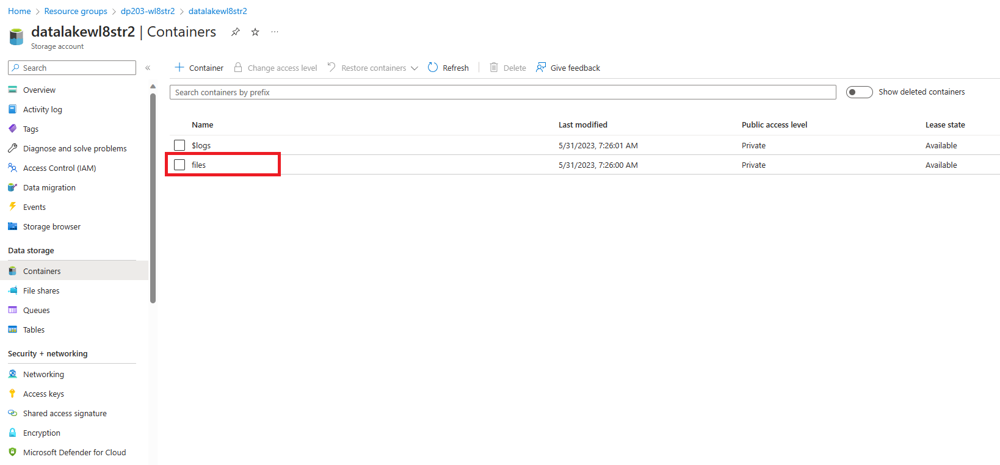

---
lab:
  title: Analyser les données dans une base de données de lac
  ilt-use: Suggested demo
---

# Analyser les données dans une base de données de lac

Azure Synapse Analytics vous permet de combiner la flexibilité du stockage de fichiers dans un lac de données avec les fonctionnalités de schéma structuré et d’interrogation SQL d’une base de données relationnelle grâce à la possibilité de créer une *base de données de lac*. Une base de données de lac est un schéma de base de données relationnelle défini sur un magasin de fichiers de lac de données qui permet de séparer le stockage de données du calcul utilisé pour l’interroger. Les bases de données de lac combinent les avantages d’un schéma structuré qui inclut la prise en charge des types de données, des relations et d’autres fonctionnalités généralement que l’on ne retrouve que dans les systèmes de base de données relationnelle, avec la possibilité de stocker des données dans des fichiers qui peuvent être utilisés indépendamment d’un magasin de bases de données relationnelle. Pour schématiser, la base de données de lac « superpose » un schéma relationnel sur des fichiers dans des dossiers de lac de données.

Cet exercice devrait prendre environ **45** minutes.

## Avant de commencer

Vous avez besoin d’un [abonnement Azure](https://azure.microsoft.com/free) dans lequel vous avez un accès administratif.

## Provisionner un espace de travail Azure Synapse Analytics

Pour prendre en charge une base de données de lac, vous avez besoin d’un espace de travail Azure Synapse Analytics ayant accès au stockage de lac de données. Il n’est pas nécessaire d’utiliser un pool SQL dédié, car vous pouvez définir la base de données de lac à l’aide du pool SQL serverless intégré. Si vous le souhaitez, vous pouvez également utiliser un pool Spark pour utiliser des données de la base de données de lac.

Dans cet exercice, vous allez utiliser la combinaison d’un script PowerShell et d’un modèle ARM pour approvisionner un espace de travail Azure Synapse Analytics.

1. Connectez-vous au [portail Azure](https://portal.azure.com) à l’adresse `https://portal.azure.com`.
2. Utilisez le bouton **[\>_]** à droite de la barre de recherche, en haut de la page, pour créer un environnement Cloud Shell dans le portail Azure, en sélectionnant un environnement ***PowerShell*** et en créant le stockage si vous y êtes invité. Cloud Shell fournit une interface de ligne de commande dans un volet situé en bas du portail Azure, comme illustré ici :

    

    > **Remarque** : si vous avez déjà créé un interpréteur de commandes cloud qui utilise un environnement *Bash*, utilisez le menu déroulant en haut à gauche du volet de l’interpréteur de commandes cloud pour le remplacer par ***PowerShell***.

3. Notez que vous pouvez redimensionner le volet Cloud Shell en faisant glisser la barre de séparation en haut du volet. Vous pouvez aussi utiliser les icônes **&#8212;** , **&#9723;** et **X** situées en haut à droite du volet pour réduire, agrandir et fermer le volet. Pour plus d’informations sur l’utilisation d’Azure Cloud Shell, consultez la [documentation Azure Cloud Shell](https://docs.microsoft.com/azure/cloud-shell/overview).

4. Dans le volet PowerShell, entrez les commandes suivantes pour cloner ce référentiel :

    ```
    rm -r dp-203 -f
    git clone https://github.com/MicrosoftLearning/dp-203-azure-data-engineer dp-203
    ```

5. Une fois que le référentiel a été cloné, entrez les commandes suivantes pour accéder au dossier de cet exercice et exécutez le script **setup.ps1** qu’il contient :

    ```
    cd dp-203/Allfiles/labs/04
    ./setup.ps1
    ```

6. Si vous y êtes invité, choisissez l’abonnement à utiliser (uniquement si vous avez accès à plusieurs abonnements Azure).
7. Lorsque vous y êtes invité, entrez un mot de passe approprié à définir pour votre pool SQL Azure Synapse.

    > **Remarque** : veillez à mémoriser ce mot de passe.

8. Attendez que le script se termine. Cela prend généralement environ 10 minutes, mais dans certains cas, cela peut prendre plus de temps. Pendant que vous attendez, consultez les articles [Base de données de lac](https://docs.microsoft.com/azure/synapse-analytics/database-designer/concepts-lake-database) et [Modèles de base de données de lac](https://docs.microsoft.com/azure/synapse-analytics/database-designer/concepts-database-templates) dans la documentation Azure Synapse Analytics.

## Modifier les autorisations du conteneur

1. Une fois le script de déploiement terminé, dans le portail Azure, accédez au groupe de ressources **dp203-*xxxxxxx*** qu’il a créé, et notez que ce groupe de ressources contient votre espace de travail Synapse, un compte de stockage pour votre lac de données et un pool Apache Spark.
1. Sélectionnez le **Compte de stockage** de votre lac de données nommé **datalakexxxxxxx**. 

     

1. Dans le conteneur **datalakexxxxxx**, sélectionnez le dossier **files**.

    

1. Dans le dossier **files**, vous constaterez que la **Méthode d’authentification :** répertoriée est ***Clé d’accès (Basculer vers un compte d’utilisateur Azure AD)***. Cliquez dessus pour passer au compte d’utilisateur Azure AD.

    
## Créer une base de données de lac

Une base de données de lac est un type de base de données que vous pouvez définir dans votre espace de travail et utiliser avec le pool SQL serverless intégré.

1. Sélectionnez votre espace de travail Synapse puis, dans sa page **Vue d’ensemble**, dans la carte **Ouvrir Synapse Studio**, sélectionnez **Ouvrir** pour ouvrir Synapse Studio dans un nouvel onglet de navigateur. Connectez-vous si vous y êtes invité.
2. Sur le côté gauche de Synapse Studio, utilisez l’icône **&rsaquo;&rsaquo;** pour développer le menu. Cela permet d’afficher les différentes pages de Synapse Studio qui vous permettront de gérer les ressources et d’effectuer des tâches d’analytique de données.
3. Dans la page **Données**, affichez l’onglet **Lié** et vérifiez que votre espace de travail inclut un lien vers votre compte de stockage Azure Data Lake Storage Gen2.
4. Dans la page **Données**, revenez à l’onglet **Espace de travail** et notez qu’il n’y a aucune base de données dans votre espace de travail.
5. Dans le menu **+**, sélectionnez **Base de données de lac** pour ouvrir un nouvel onglet dans lequel vous pouvez concevoir votre schéma de base de données (acceptez les conditions d’utilisation des modèles de base de données si vous y êtes invité).
6. Dans le volet **Propriétés** de la nouvelle base de données, remplacez le **Nom** par **RetailDB** et vérifiez que la propriété **Dossier d’entrée** est automatiquement mise à jour sur **files/RetailDB**. Conservez le **Format de données** **Texte délimité** (vous pouvez également utiliser le format *Parquet* et remplacer le format de fichier pour des tables individuelles. Nous allons utiliser des données délimitées par des virgules dans cet exercice.)
7. En haut du volet **RetailDB**, sélectionnez **Publier** pour enregistrer la base de données actuelle.
8. Dans le volet **Données** à gauche, affichez l’onglet **Lié**. Développez ensuite **Azure Data Lake Storage Gen2** et le magasin **datalake*xxxxxxx*** principal de votre espace de travail **synapse*xxxxxxx***, puis sélectionnez le système de fichiers **files** qui contient actuellement un dossier nommé **synapse**.
9.  Sous l’onglet **files** qui s’ouvre, utilisez le bouton **+ Nouveau dossier** pour créer un dossier nommé **RetailDB**. Il s’agit du dossier d’entrée des fichiers de données utilisés par les tables de votre base de données.

## Créer une table

Maintenant que vous avez créé une base de données de lac, vous pouvez définir son schéma en créant des tables.

### Définir le schéma de table

1. Revenez à l’onglet **RetailDB** de votre définition de base de données puis, dans la liste **+Table**, sélectionnez **Personnalisé** et notez qu’une nouvelle table nommée **Table_1** est ajoutée à votre base de données.
2. Avec **Table_1** sélectionnée, sous l’onglet **Général** sous le canevas de conception de base de données, définissez la propriété **Nom** sur **Customer**.
3. Développez la section **Paramètres de stockage pour la table** et notez que la table sera stockée sous forme de texte délimité dans le dossier **files/RetailDB/Customer** dans le Data Lake Store par défaut de votre espace de travail Synapse.
4. Sous l’onglet **Colonnes**, notez que, par défaut, la table contient une colonne nommée **Column_1**. Modifiez la définition de colonne pour qu’elle corresponde aux propriétés suivantes :

    | Nom | Clés | Description | Possibilité de valeurs nulles | Type de données | Format / Longueur |
    | ---- | ---- | ----------- | ----------- | --------- | --------------- |
    | Customerid | PK  | ID client unique | &#128454;  | long | |

5. Dans la liste **+ Colonne**, sélectionnez **Nouvelle colonne** et modifiez la nouvelle définition de colonne pour ajouter une colonne **FirstName** à la table comme suit :

    | Nom | Clés | Description | Possibilité de valeurs nulles | Type de données | Format / Longueur |
    | ---- | ---- | ----------- | ----------- | --------- | --------------- |
    | Customerid | PK  | ID client unique | &#128454;  | long | |
    | **FirstName** | **PK ** | **Prénom du client** | **&#128454;** | **string** | **256** |

6. Ajoutez d’autres colonnes jusqu’à ce que la définition de table ressemble à ceci :

    | Nom | Clés | Description | Possibilité de valeurs nulles | Type de données | Format / Longueur |
    | ---- | ---- | ----------- | ----------- | --------- | --------------- |
    | Customerid | PK  | ID client unique | &#128454;  | long | |
    | FirstName | PK  | Prénom du client | &#128454; | string | 256 |
    | LastName | PK  | Nom du client | &#128505; | string | 256 |
    | EmailAddress | PK  | Adresse e-mail du client | &#128454; | string | 256 |
    | Téléphone | PK  | Numéro de téléphone du client | &#128505; | string | 256 |

7. Lorsque vous avez ajouté toutes les colonnes, publiez à nouveau la base de données pour enregistrer les modifications.
8. Dans le volet **Données** à gauche, revenez à l’onglet **Espace de travail** pour voir la base de données de lac **RetailDB**. Développez-la ensuite et actualisez son dossier **Tables** pour voir la table **Customer** nouvellement créée.

### Charger des données dans le chemin de stockage de la table

1. Dans le volet principal, revenez à l’onglet **files**, qui contient le système de fichiers avec le dossier **RetailDB**. Ouvrez ensuite le dossier **RetailDB** et créez un dossier nommé **Customer** dans celui-ci. C’est de là que la table **Customer** tirera ses données.
2. Ouvrez le nouveau dossier **Customer**, qui doit être vide.
3. Téléchargez le fichier de données **customer.csv** à partir de [https://raw.githubusercontent.com/MicrosoftLearning/dp-203-azure-data-engineer/master/Allfiles/labs/04/data/customer.csv](https://raw.githubusercontent.com/MicrosoftLearning/dp-203-azure-data-engineer/master/Allfiles/labs/04/data/customer.csv) et enregistrez-le dans un dossier sur votre ordinateur local (l’emplacement n’a pas d’importance). Ensuite, dans le dossier **Customer** dans l’Explorateur Synapse, utilisez le bouton **⤒ Charger** pour charger le fichier **customer.csv** dans le dossier **RetailDB/Customer** de votre lac de données.

    > **Remarque** : dans un scénario de production réel, vous créez probablement un pipeline pour ingérer des données dans le dossier des données de table. Par souci de commodité, nous le chargeons directement dans l’interface utilisateur Synapse Studio dans cet exercice.

4. Dans le volet **Données** à gauche, sous l’onglet **Espace de travail**, dans le menu **...** de la table **Customer**, sélectionnez **Nouveau script SQL > ****Sélectionner les 100 premières lignes**. Ensuite, dans le nouveau volet **Script SQL 1** qui s’ouvre, vérifiez que le pool SQL **Intégré** est connecté et utilisez le bouton **▷ Exécuter** pour exécuter le code SQL. Les résultats doivent inclure les 100 premières lignes de la table **Customer**, en fonction des données stockées dans le dossier sous-jacent du lac de données.
5. Fermez l’onglet **Script SQL 1** en ignorant vos modifications.

## Créer une table à partir d’un modèle de base de données

Comme vous l’avez vu, vous pouvez créer les tables dont vous avez besoin dans votre base de données de lac à partir de zéro. Toutefois, Azure Synapse Analytics fournit également de nombreux modèles de base de données basés sur des charges de travail et des entités de base de données courantes que vous pouvez utiliser comme point de départ pour votre schéma de base de données.

### Définir le schéma de table

1. Dans le volet principal, revenez au volet **RetailDB**, qui contient votre schéma de base de données (qui ne contient actuellement que la table **Customer**).
2. Dans le menu **+ Table**, sélectionnez **À partir du modèle**. Ensuite, dans la page **Ajouter à partir d’un modèle**, sélectionnez **Retail**, puis cliquez sur **Continuer**.
3. Dans la page **Ajouter à partir d’un modèle (Retail)**, attendez que la liste de tables se remplisse, puis développez **Product** et sélectionnez **RetailProduct**. Cliquez ensuite sur **Ajouter**. Une nouvelle table basée sur le modèle **RetailProduct** est ajoutée à votre base de données.
4. Dans le volet **RetailDB**, sélectionnez la nouvelle table **RetailProduct**. Ensuite, dans le volet sous le canevas de conception, sous l’onglet **Général**, renommez en **Product** et vérifiez que les paramètres de stockage de la table spécifient le dossier d’entrée **files/RetailDB/Product**.
5. Sous l’onglet **Colonnes** de la table **Product**, notez que la table inclut déjà un grand nombre de colonnes héritées du modèle. Il y a plus de colonnes que nécessaire pour cette table. Vous devrez donc en supprimer.
6. Cochez la case en regard de **Nom** pour sélectionner toutes les colonnes, puis <u>désélectionnez</u> les colonnes suivantes (que vous devez conserver) :
    - ProductId
    - ProductName
    - IntroductionDate
    - ActualAbandonmentDate
    - ProductGrossWeight
    - ItemSku
7. Dans la barre d’outils du volet **Colonnes**, sélectionnez **Supprimer** pour supprimer les colonnes sélectionnées. Les colonnes conservées doivent être les suivantes :

    | Nom | Clés | Description | Possibilité de valeurs nulles | Type de données | Format / Longueur |
    | ---- | ---- | ----------- | ----------- | --------- | --------------- |
    | ProductId | PK  | Identificateur unique d’un produit. | &#128454;  | long | |
    | ProductName | PK  | Nom du produit. | &#128505; | string | 128 |
    | IntroductionDate | PK  | Date à laquelle le produit a été commercialisé. | &#128505; | date | AAAA-MM-JJ |
    | ActualAbandonmentDate | PK  | Date réelle à laquelle le produit n’a plus fait l’objet d’un marketing. | &#128505; | date | AAAA-MM-JJ |
    | ProductGrossWeight | PK  | Poids brut du produit. | &#128505; | Décimal | 18,8 |
    | ItemSku | PK  | Identificateur de l’unité de gestion de stock. | &#128505; | string | 20 |

8. Ajoutez une nouvelle colonne nommée **ListPrice** à la table, comme indiqué ici :

    | Nom | Clés | Description | Possibilité de valeurs nulles | Type de données | Format / Longueur |
    | ---- | ---- | ----------- | ----------- | --------- | --------------- |
    | ProductId | PK  | Identificateur unique d’un produit. | &#128454;  | long | |
    | ProductName | PK  | Nom du produit. | &#128505; | string | 128 |
    | IntroductionDate | PK  | Date à laquelle le produit a été commercialisé. | &#128505; | date | AAAA-MM-JJ |
    | ActualAbandonmentDate | PK  | Date réelle à laquelle le produit n’a plus fait l’objet d’un marketing. | &#128505; | date | AAAA-MM-JJ |
    | ProductGrossWeight | PK  | Poids brut du produit. | &#128505; | Décimal | 18,8 |
    | ItemSku | PK  | Identificateur de l’unité de gestion de stock. | &#128505; | string | 20 |
    | **ListPrice** | **PK ** | **Prix du produit.** | **&#128454;** | **decimal** | **18,2** |

9. Lorsque vous avez modifié les colonnes comme indiqué ci-dessus, publiez à nouveau la base de données pour enregistrer les modifications.
10. Dans le volet **Données** à gauche, revenez à l’onglet **Espace de travail** pour voir la base de données de lac **RetailDB**. Utilisez ensuite le menu **...** pour son dossier **Tables** afin d’actualiser la vue et de voir la table **Product** nouvellement créée.

### Charger des données dans le chemin de stockage de la table

1. Dans le volet principal, revenez à l’onglet **files** qui contient le système de fichiers, puis accédez au dossier **files/RetailDB**, qui contient actuellement le dossier **Customer** de la table que vous avez créée précédemment.
2. Dans le dossier **RetailDB**, créez un dossier nommé **Product**. C’est de là que la table **Product** tirera ses données.
3. Ouvrez le nouveau dossier **Product** qui doit être vide.
4. Téléchargez le fichier de données **product.csv** à partir de [https://raw.githubusercontent.com/MicrosoftLearning/dp-203-azure-data-engineer/master/Allfiles/labs/04/data/product.csv](https://raw.githubusercontent.com/MicrosoftLearning/dp-203-azure-data-engineer/master/Allfiles/labs/04/data/product.csv) et enregistrez-le dans un dossier sur votre ordinateur local (l’emplacement n’a pas d’importance). Ensuite, dans le dossier **Produit** dans l’Explorateur Synapse, utilisez le bouton **⤒ Charger** pour charger le fichier **product.csv** dans le dossier **RetailDB/Product** de votre lac de données.
5. Dans le volet **Données** à gauche, sous l’onglet **Espace de travail**, dans le menu **...** de la table **Product**, sélectionnez **Nouveau script SQL > ****Sélectionner les 100 premières lignes**. Ensuite, dans le nouveau volet **Script SQL 1** qui s’ouvre, vérifiez que le pool SQL **Intégré** est connecté et utilisez le bouton **▷ Exécuter** pour exécuter le code SQL. Les résultats doivent inclure les 100 premières lignes de la table **Product**, en fonction des données stockées dans le dossier sous-jacent du lac de données.
6. Fermez l’onglet **Script SQL 1** en ignorant vos modifications.

## Créer une table à partir de données existantes

Jusqu’à présent, vous avez créé des tables, puis les avez remplies de données. Dans certains cas, vous pouvez déjà disposer de données dans un lac de données à partir duquel vous souhaitez dériver une table.

### Charger des données

1. Dans le volet principal, revenez à l’onglet **files** qui contient le système de fichiers, puis accédez au dossier **files/RetailDB** qui contient actuellement les dossiers **Customer** et **Product** pour les tables que vous avez créées précédemment.
2. Dans le dossier **RetailDB**, créez un dossier nommé **SalesOrder**.
3. Ouvrez le nouveau dossier **SalesOrder** qui doit être vide.
4. Téléchargez le fichier de données **salesorder.csv** à partir de [https://raw.githubusercontent.com/MicrosoftLearning/dp-203-azure-data-engineer/master/Allfiles/labs/04/data/salesorder.csv](https://raw.githubusercontent.com/MicrosoftLearning/dp-203-azure-data-engineer/master/Allfiles/labs/04/data/salesorder.csv) et enregistrez-le dans un dossier sur votre ordinateur local (l’emplacement n’a pas d’importance). Ensuite, dans le dossier **SalesOrder** dans l’Explorateur Synapse, utilisez le bouton **⤒ Charger** pour charger le fichier **salesorder.csv** dans le dossier **RetailDB/SalesOrder** de votre lac de données.

### Créer une table

1. Dans le volet principal, revenez au volet **RetailDB** qui contient votre schéma de base de données (contenant actuellement les tables **Customer** et **Product**).
2. Dans le menu **+ Table**, sélectionnez **À partir du lac de données**. Ensuite, dans le volet **Créer une table externe à partir d’un lac de données**, spécifiez les options suivantes :
    - **Nom de la table externe** : SalesOrder.
    - **Service lié** : sélectionnez **synapse*xxxxxxx*-WorkspaceDefautStorage(datalake*xxxxxxx*)**.
    - **Fichier d’entrée du dossier** : files/RetailDB/SalesOrder.
3. Passez à la page suivante, puis créez la table avec les options suivantes :
    - **Type de fichier** : CSV.
    - **Marque de fin de champ** : valeur par défaut (virgule ,).
    - **Première ligne** : laissez *déduire les noms de colonnes*<u>désélectionné</u>.
    - **Délimiteur de chaîne** : valeur par défaut (Chaîne vide).
    - **Utiliser le type par défaut** : type par défaut (true,false)
    - **Longueur maximale de chaîne** : 4 000.

4. Lorsque la table a été créée, notez qu’elle inclut des colonnes nommées **C1**, **C2**, etc., et que les types de données ont été déduits des données du dossier. Modifiez les définitions de colonne comme suit :

    | Nom | Clés | Description | Possibilité de valeurs nulles | Type de données | Format / Longueur |
    | ---- | ---- | ----------- | ----------- | --------- | --------------- |
    | SalesOrderId | PK  | Identificateur unique d’une commande. | &#128454;  | long | |
    | OrderDate | PK  | Date de la commande. | &#128454; | timestamp | yyyy-MM-dd |
    | LineItemId | PK  | ID d’un article individuel. | &#128454; | long | |
    | Customerid | PK  | Client. | &#128454; | long | |
    | ProductId | PK  | Produit. | &#128454; | long | |
    | Quantity | PK  | Quantité commandée. | &#128454; | long | |

    > **Remarque** : la table contient un enregistrement pour chaque article individuel commandé et inclut une clé primaire composite constituée de **SalesOrderId** et **LineItemId**.

5. Sous l’onglet **Relations** de la table **SalesOrder**, dans la liste **Relation**, sélectionnez **Vers la table**, puis définissez la relation suivante :

    | De la table | De la colonne | Vers la table | Vers la colonne |
    | ---- | ---- | ----------- | ----------- |
    | Client | Customerid | Commande client | Customerid |

6. Ajoutez une seconde relation *Vers la table* avec les paramètres suivants :

    | De la table | De la colonne | Vers la table | Vers la colonne |
    | ---- | ---- | ----------- | ----------- |
    | Produit | ProductId | Commande client | ProductId |

    La possibilité de définir des relations entre des tables permet d’optimiser l’intégrité référentielle entre des entités de données associées. Il s’agit d’une fonctionnalité courante des bases de données relationnelles qui seraient autrement difficiles à appliquer aux fichiers d’un lac de données.

7. Publiez à nouveau la base de données pour enregistrer les modifications.
8. Dans le volet **Données** à gauche, revenez à l’onglet **Espace de travail** pour voir la base de données de lac **RetailDB**. Utilisez ensuite le menu **...** de son dossier **Tables** pour actualiser la vue et voir la table **SalesOrder** nouvellement créée.

## Utiliser des tables de base de données de lac

Maintenant que vous avez des tables dans votre base de données, vous pouvez les utiliser pour vous servir des données sous-jacentes.

### Interroger des tables via SQL

1. Dans Synapse Studio, sélectionnez la page **Développer**.
2. Dans le volet **Développer**, dans le menu ****+, sélectionnez **Script SQL**.
3. Dans le nouveau **script SQL 1**, vérifiez si le script est connecté au **pool SQL intégré** et dans la **liste des bases de données** utilisateur, sélectionnez **RetailDB**.
4. Entrez le code SQL suivant :

    ```sql
    SELECT o.SalesOrderID, c.EmailAddress, p.ProductName, o.Quantity
    FROM SalesOrder AS o
    JOIN Customer AS c ON o.CustomerId = c.CustomerId
    JOIN Product AS p ON o.ProductId = p.ProductId
    ```

5. Utilisez le bouton **▷ Exécuter** pour exécuter le code SQL.

    Les résultats affichent les détails de la commande avec les informations du client et du produit.

6. Fermez le volet **Script SQL 1**, en supprimant les modifications que vous avez effectuées.

### Insérer des données à l’aide de Spark

1. Dans le volet **Développer**, dans le menu **+**, sélectionnez **Bloc-notes**.
2. Dans le nouveau volet **Bloc-notes 1**, joignez le bloc-notes au pool Spark **spark*xxxxxxx****.
3. Exécutez le code suivant dans la cellule vide du bloc-notes :

    ```
    %%sql
    INSERT INTO `RetailDB`.`SalesOrder` VALUES (99999, CAST('2022-01-01' AS TimeStamp), 1, 6, 5, 1)
    ```

4. Utilisez le bouton **▷** à gauche de la cellule pour l’exécuter. Veuillez patienter jusqu’à la fin de l’exécution. Notez qu’il faudra un certain temps pour démarrer le pool Spark.
5. Utilisez le bouton **+ Code** pour ajouter une nouvelle cellule au bloc-notes.
6. Dans la nouvelle cellule, entrez le code suivant :

    ```
    %%sql
    SELECT * FROM `RetailDB`.`SalesOrder` WHERE SalesOrderId = 99999
    ```
7. Utilisez le bouton **▷** à gauche de la cellule pour l’exécuter. Vérifiez si une ligne pour la commande client 99999 a été insérée dans la table **SalesOrder**.
8. Fermez le volet **Bloc-notes 1**, arrêtez la session Spark et supprimez les modifications que vous avez effectuées.

## Supprimer les ressources Azure

Si vous avez fini d’explorer Azure Synapse Analytics, vous devriez supprimer les ressources que vous avez créées afin d’éviter des coûts Azure inutiles.

1. Fermez l’onglet du navigateur Synapse Studio et revenez dans le portail Azure.
2. Dans le portail Azure, dans la page **Accueil**, sélectionnez **Groupes de ressources**.
3. Sélectionnez le groupe de ressources **dp203-*xxxxxxx*** pour votre espace de travail Synapse Analytics (et non le groupe de ressources géré). Vérifiez s’il contient l’espace de travail Synapse, le compte de stockage et le pool Spark pour votre espace de travail.
4. Au sommet de la page **Vue d’ensemble** de votre groupe de ressources, sélectionnez **Supprimer le groupe de ressources**.
5. Entrez le nom du groupe de ressources **dp203-*xxxxxxx*** pour confirmer que vous souhaitez le supprimer, puis sélectionnez **Supprimer**.

    Après quelques minutes, votre espace de travail Azure Synapse et l’espace de travail managé qui lui est associé seront supprimés.
