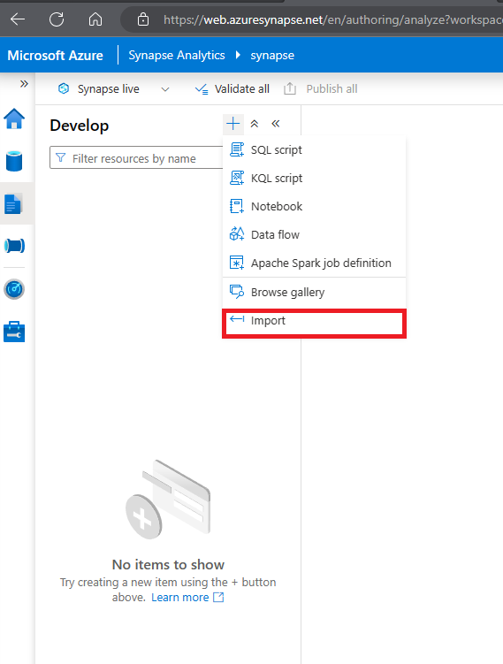

---
lab:
  title: Transformer des données avec Spark dans Azure Synapse Analytics
  ilt-use: Lab
---

# Transformer des données avec Spark dans Azure Synapse Analytics

Les ingénieurs* données *utilisent souvent des notebooks Spark comme l’un de leurs outils préférés pour effectuer *des activités d’extraction, de transformation et de chargement (ETL)* ou *d’extraction, de chargement et de transformation (ELT)* qui transforment les données d’un format ou d’une structure vers une autre.

Dans cet exercice, vous allez utiliser un notebook Spark dans Azure Synapse Analytics pour transformer des données dans des fichiers.

Cet exercice devrait prendre environ **30** minutes.

## Avant de commencer

Vous avez besoin d’un [abonnement Azure](https://azure.microsoft.com/free) dans lequel vous avez un accès administratif.

## Provisionner un espace de travail Azure Synapse Analytics

Vous aurez besoin d’un espace de travail Azure Synapse Analytics avec accès au stockage data lake et à un pool Spark.

Dans cet exercice, vous allez utiliser une combinaison d’un script PowerShell et d’un modèle ARM pour approvisionner un espace de travail Azure Synapse Analytics.

1. Connectez-vous au [portail Azure](https://portal.azure.com) à l’adresse `https://portal.azure.com`.
2. Utilisez le bouton **[\>_]** à droite de la barre de recherche, en haut de la page, pour créer un environnement Cloud Shell dans le portail Azure, en sélectionnant un environnement ***Bash*** et en créant le stockage si vous y êtes invité. Cloud Shell fournit une interface de ligne de commande dans un volet situé en bas du portail Azure, comme illustré ici :

    

    > **Remarque** : Si vous avez créé un interpréteur de commandes cloud qui utilise un *environnement Bash* , utilisez le menu déroulant en haut à gauche du volet Cloud Shell pour le remplacer par ***PowerShell***.

3. Notez que vous pouvez redimensionner le volet Cloud Shell en faisant glisser la barre de séparation en haut du volet. Vous pouvez aussi utiliser les icônes **&#8212;** , **&#9723;** et **X** situées en haut à droite du volet pour réduire, agrandir et fermer le volet. Pour plus d’informations sur l’utilisation d’Azure Cloud Shell, consultez la [documentation Azure Cloud Shell](https://docs.microsoft.com/azure/cloud-shell/overview).

4. Dans le terminal, entrez les commandes suivantes pour cloner ce dépôt :

    ```
    rm -r dp-203 -f
    git clone https://github.com/MicrosoftLearning/dp-203-azure-data-engineer dp-203
    ```

5. Une fois que le dépôt a été cloné, entrez les commandes suivantes pour accéder au dossier de ce labo et exécutez le script **setup.sh** qu’il contient :

    ```
    cd dp-203/Allfiles/labs/06
    ./setup.ps1
    ```

6. Si vous y êtes invité, choisissez l’abonnement que vous souhaitez utiliser (cela se produit uniquement si vous avez accès à plusieurs abonnements Azure).
7. Lorsque vous y êtes invité, entrez un mot de passe approprié à définir pour le pool SQL Azure Synapse.

    > Veillez à le mémoriser.

8. Attendez que le script se termine, ce qui prend généralement entre 5 et 10 minutes. Pendant que vous attendez, consultez l’article [Apache Spark dans Azure Synapse Analytics Core Concepts](https://learn.microsoft.com/azure/synapse-analytics/spark/apache-spark-concepts) dans la documentation Azure Synapse Analytics.

## Utiliser un notebook Spark pour transformer des données

1. Une fois le script de déploiement terminé, dans le Portail Azure, accédez au **groupe de ressources dp203-*xxxxxxx*** qu’il a créé, et notez que ce groupe de ressources contient votre espace de travail Synapse, un compte Stockage pour votre lac de données et un pool Apache Spark.
2. Sélectionnez votre espace de travail Synapse et, dans sa **page Vue d’ensemble**, dans l’carte **Ouvrir Synapse Studio**, sélectionnez **Ouvrir** pour ouvrir Synapse Studio dans un nouvel onglet de navigateur ; connectez-vous si vous y êtes invité.
3. Sur le côté gauche de Synapse Studio, utilisez l’icône **&rsaquo;&rsaquo;** pour développer le menu. Cela permet d’afficher les différentes pages de Synapse Studio qui vous permettront de gérer les ressources et d’effectuer des tâches d’analytique de données.
4. Dans la **page Gérer** , sélectionnez l’onglet **Pools** Apache Spark et notez qu’un pool Spark portant un nom similaire à **spark*xxxxxxx*** a été provisionné dans l’espace de travail.
5. Dans la **page Données**, affichez l’onglet **Lié** et vérifiez que votre espace de travail inclut un lien vers votre compte de stockage Azure Data Lake Stockage Gen2, qui doit avoir un nom similaire à **synapse*xxxxxxx* (Primary - datalake*xxxxxxx*)**.
6. Développez votre compte de stockage et vérifiez qu’il contient un conteneur de système de fichiers nommé **fichiers (principal).**
7. Sélectionnez le conteneur de **fichiers** , puis notez qu’il contient des dossiers nommés **données** et **synapse**. Le dossier synapse est utilisé par Azure Synapse et le **dossier de données** contient les fichiers de données que vous allez interroger.
8. Ouvrez le **dossier de données** et observez qu’il contient des fichiers .csv pendant trois ans de données de vente.
9. Cliquez avec le bouton droit sur l’un des fichiers et sélectionnez **Aperçu** pour afficher les données qu’il contient. Notez que les fichiers contiennent une ligne d’en-tête. Vous pouvez donc sélectionner l’option permettant d’afficher les en-têtes de colonne.
10. Fermez l’aperçu. **Téléchargez ensuite Spark Transform.ipynb** à partir de[https://raw.githubusercontent.com/MicrosoftLearning/dp-203-azure-data-engineer/master/Allfiles/labs/06/notebooks/Spark%20Transform.ipynb](https://raw.githubusercontent.com/MicrosoftLearning/dp-203-azure-data-engineer/master/Allfiles/labs/06/notebooks/Spark%20Transform.ipynb)

    > **Remarque** : il est préférable de copier ce texte à l’aide de la ***touche Ctrl+a*** , puis ***ctrl+c*** et coller dans un outil à l’aide ***de ctrl+v***, par exemple, du Bloc-notes, puis d’utiliser le fichier, d’enregistrer en tant que **Spark Transform.ipynb** avec un type de fichier de ***tous les fichiers***.

11. Ensuite, dans **la page Développer** , développez **notebooks** , cliquez sur les options + Importer

    
        
12. Sélectionnez le fichier que vous venez de télécharger et d’enregistrer en tant que **Spark Transfrom.ipynb**.
13. Attachez le bloc-notes à votre **pool Spark*xxxxxxx***.
14. Passez en revue les notes du bloc-notes et exécutez les cellules de code.

    > **Remarque** : la première cellule de code prend quelques minutes, car le pool Spark doit être démarré. Les cellules suivantes s’exécutent plus rapidement.

## Supprimer les ressources Azure

Si vous avez fini d’explorer Azure Synapse Analytics, vous devriez supprimer les ressources que vous avez créées afin d’éviter des coûts Azure inutiles.

1. Fermez l’onglet du navigateur Synapse Studio et revenez dans le portail Azure.
2. Dans le portail Azure, dans la page **Accueil**, sélectionnez **Groupes de ressources**.
3. Sélectionnez le groupe de ressources pour votre espace de travail Synapse Analytics (et non le groupe de ressources managé) et vérifiez qu’il contient l’espace de travail Synapse, le compte de stockage et le pool Spark pour votre espace de travail.
4. Au sommet de la page **Vue d’ensemble** de votre groupe de ressources, sélectionnez **Supprimer le groupe de ressources**.
5. Entrez le nom du groupe de ressources pour confirmer que vous souhaitez le supprimer, puis sélectionnez Supprimer.

    Après quelques minutes, votre espace de travail Azure Synapse et l’espace de travail managé qui lui est associé seront supprimés.
