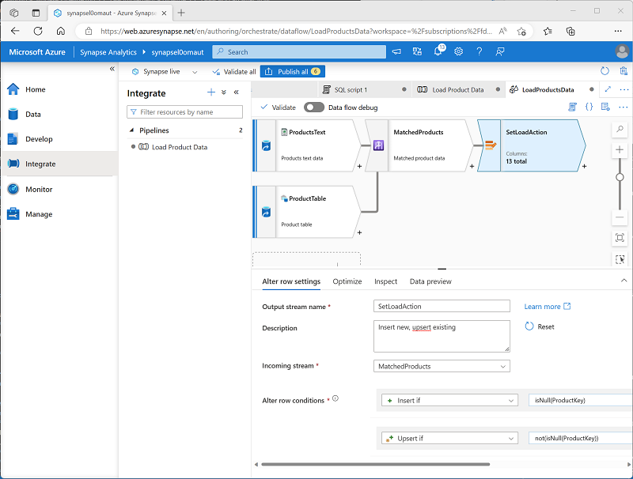
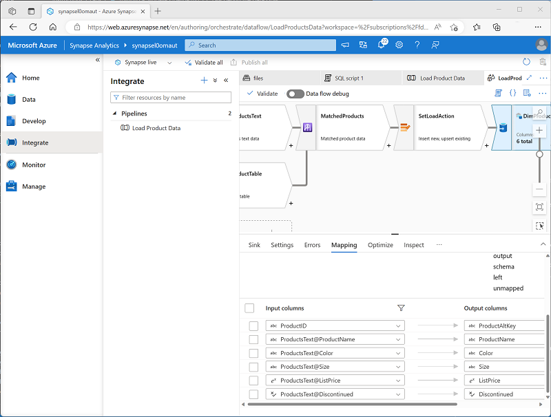

---
lab:
  title: Créer un pipeline de données dans Azure Synapse Analytics
  ilt-use: Lab
---

# Créer un pipeline de données dans Azure Synapse Analytics

Dans cet exercice, vous allez charger des données dans un pool SQL dédié à l’aide d’un pipeline dans l’Explorateur Azure Synapse Analytics. Le pipeline encapsule un flux de données qui charge les données de produit dans une table d’un entrepôt de données.

Cet exercice devrait prendre environ **45** minutes.

## Avant de commencer

Vous avez besoin d’un [abonnement Azure](https://azure.microsoft.com/free) dans lequel vous avez un accès administratif.

## Provisionner un espace de travail Azure Synapse Analytics

Vous aurez besoin d’un espace de travail Azure Synapse Analytics avec accès au stockage de lac de données et à un pool SQL dédié hébergeant un entrepôt de données relationnel.

Dans cet exercice, vous allez utiliser la combinaison d’un script PowerShell et d’un modèle ARM pour approvisionner un espace de travail Azure Synapse Analytics.

1. Connectez-vous au [portail Azure](https://portal.azure.com) à l’adresse `https://portal.azure.com`.
2. Utilisez le bouton **[\>_]** à droite de la barre de recherche, en haut de la page, pour créer un environnement Cloud Shell dans le portail Azure, puis sélectionnez un environnement ***PowerShell*** et créez le stockage si vous y êtes invité. Cloud Shell fournit une interface de ligne de commande dans un volet situé en bas du portail Azure, comme illustré ici :

    

    > **Remarque** : si vous avez déjà créé un interpréteur de commandes cloud qui utilise un environnement *Bash*, utilisez le menu déroulant en haut à gauche du volet de l’interpréteur de commandes Cloud Shell pour le remplacer par ***PowerShell***.

3. Notez que vous pouvez redimensionner Cloud Shell en faisant glisser la barre de séparation en haut du volet. Vous pouvez aussi utiliser les icônes —, **◻** et **X** situées en haut à droite du volet pour réduire, agrandir et fermer le volet. Pour plus d’informations sur l’utilisation d’Azure Cloud Shell, consultez la [documentation Azure Cloud Shell](https://docs.microsoft.com/azure/cloud-shell/overview).

4. Dans le volet PowerShell, entrez les commandes suivantes pour cloner ce référentiel :

    ```powershell
    rm -r dp-203 -f
    git clone https://github.com/MicrosoftLearning/dp-203-azure-data-engineer dp-203
    ```

5. Une fois que le référentiel a été cloné, entrez les commandes suivantes pour accéder au dossier de cet exercice et exécutez le script **setup.ps1** qu’il contient :

    ```powershell
    cd dp-203/Allfiles/labs/10
    ./setup.ps1
    ```

6. Si vous y êtes invité, choisissez l’abonnement à utiliser (uniquement si vous avez accès à plusieurs abonnements Azure).
7. Quand vous y êtes invité, entrez un mot de passe approprié à définir pour votre pool Azure Synapse SQL.

    > **Remarque** : veillez à mémoriser ce mot de passe.

8. Attendez que le script se termine. Cela prend généralement environ 10 minutes, mais dans certains cas, cela peut prendre plus de temps. En attendant, passez en revue l’article [Flux de données dans Azure Synapse Analytics](https://learn.microsoft.com/azure/synapse-analytics/concepts-data-flow-overview) dans la documentation d’Azure Synapse Analytics.

## Afficher les magasins de données source et destination

Les données sources de cet exercice sont un fichier texte contenant des données de produit. La destination est une table dans un pool SQL dédié. Votre objectif est de créer un pipeline qui encapsule un flux de données dans lequel les données de produit du fichier sont chargées dans la table avec l’insertion de nouveaux produits et la mise à jour de produits existants.

1. Une fois le script terminé, dans le portail Azure, accédez au groupe de ressources **dp203-*xxxxxxx*** qu’il a créé, puis sélectionnez votre espace de travail Synapse.
2. Dans la page **Vue d’ensemble** de votre espace de travail Synapse, dans la carte **Ouvrir Synapse Studio**, sélectionnez **Ouvrir** pour ouvrir Synapse Studio dans un nouvel onglet de navigateur. Connectez-vous si vous y êtes invité.
3. Sur le côté gauche de Synapse Studio, utilisez l’icône ›› pour développer le menu. Cela permet d’afficher les différentes pages de Synapse Studio qui vous permettront de gérer les ressources et d’effectuer des tâches d’analytique données.
4. Sur la page **Gérer**, sous l’onglet **Pools SQL**, sélectionnez la ligne du pool SQL dédié **sql*xxxxxxx*** et utilisez l’icône **▷** correspondante pour le démarrer. Confirmez si vous souhaitez le reprendre lorsque vous y êtes invité.

     Le redémarrage du pool peut prendre plusieurs minutes. Vous pouvez utiliser le bouton **↻ Actualiser** pour vérifier régulièrement son statut. L’état passe sur **En ligne** lorsque le pool est prêt. Pendant que vous attendez, passez aux étapes ci-dessous pour afficher les données sources.

5. Dans la page **Données**, affichez l’onglet **Lié** et vérifiez que votre espace de travail inclut un lien vers votre compte de stockage Azure Data Lake Storage Gen2, qui doit avoir un nom similaire à **synapse*xxxxxxx* (Primary - datalake*xxxxxxx*)**.
6. Développez votre compte de stockage et vérifiez qu’il contient un conteneur de système de fichiers nommé **files (primary)**.
7. Sélectionnez le conteneur de fichiers et notez qu’il contient un dossier nommé **data**.
8. Ouvrez le dossier **data** et observez le fichier **Product.csv** qu’il contient.
9. Cliquez avec le bouton droit sur **Product.csv** et sélectionnez **Aperçu** pour afficher les données qu’il contient. Notez qu’il contient une ligne d’en-tête et certains enregistrements de données de produit.
10. Revenez à la page **Gérer** et vérifiez que votre pool SQL dédié est désormais en ligne. Si ce n’est pas le cas, merci de patienter.
11. Sur la page **Données**, sous l’onglet **Espace de travail**, développez **Base de données SQL**, votre base de données **sql*xxxxxxx* (SQL)** et ses **Tables**.
12. Sélectionnez la table **dbo.DimProduct**. Ensuite, dans son menu **...**, sélectionnez **Nouveau script SQL** > **Sélectionner les 100 premières lignes**. Cela permet d’exécuter une requête qui retourne les données de produit de la table : il doit y avoir une seule ligne.

## Implémenter un pipeline

Pour charger les données du fichier texte dans la table de base de données, vous allez implémenter un pipeline Azure Synapse Analytics qui contient un flux de données comprenant la logique permettant d’ingérer les données à partir du fichier texte, rechercher la colonne de substitution **ProductKey** pour les produits qui existent déjà dans la base de données, puis insérer ou mettre à jour des lignes dans la table en conséquence.

### Créer un pipeline avec une activité de flux de données

1. Dans Synapse Studio, sélectionnez la page **Intégrer**. Ensuite, dans le menu **+**, sélectionnez **Pipeline** pour créer un pipeline.
2. Dans le volet **Propriétés** de votre nouveau pipeline, remplacez son nom de **Pipeline1** à **Charger des données de produit**. Utilisez ensuite le bouton **Propriétés** au-dessus du volet des **Propriétés** pour le masquer.
3. Dans le volet **Activités**, développez **Déplacer et transformer**, puis faites glisser un **flux de données** vers l’aire de conception du pipeline, comme illustré ici :

    

4. Sous l’aire de conception du pipeline, sous l’onglet **Général**, définissez la propriété **Nom** sur **LoadProducts**.
5. Sous l’onglet **Paramètres**, en bas de la liste des paramètres, développez **Processus de site** et définissez les paramètres de processus de site suivants :
    - **Service lié de processus de site** : Sélectionnez le service lié **synapse*xxxxxxx*-WorkspaceDefaultStorage**.
    - **Dossier de stockage de processus de site** : Définissez le **conteneur** sur **fichiers** et le **répertoire** sur **stage_products**.

### Configurer le flux de données

1. En haut de l’onglet **Paramètres** du flux de données **LoadProducts**, pour la propriété **Flux de données**, sélectionnez **+ Nouveau**.
2. Dans le volet **Propriétés** de la nouvelle aire de conception de flux de données qui s’ouvre, définissez le **Nom** sur **LoadProductsData**, puis masquez le volet **Propriétés**. Le concepteur de flux de données doit ressembler à ceci :

    

### Ajouter des sources

1. Dans l’aire de conception du flux de données, dans la liste déroulante **Ajouter une source**, sélectionnez **Ajouter une source**. Configurez ensuite les paramètres de source comme suit :
    - **Nom du flux de sortie** : ProductsText
    - **Description** : Données de texte des produits
    - **Type de source** : Jeu de données d’intégration
    - **Jeu de données** : Créez un **nouveau** jeu de données avec les propriétés suivantes :
        - **Type** : Azure Datalake Storage Gen2
        - **Format** : Texte délimité
        - **Nom** : Products_Csv
        - **Service lié** : synapse*xxxxxxx*-WorkspaceDefaultStorage
        - **Chemin d’accès au fichier** : files/data/Product.csv
        - **Première ligne comme en-tête** : Sélectionné
        - **Importer un schéma** : À partir de la connexion/du magasin
    - **Autoriser la dérive de schéma** : Sélectionné
2. Sous l’onglet **Projection** de la nouvelle source **ProductsText**, définissez les types de données suivants :
    - **ProductID** : chaîne
    - **ProductName** : chaîne
    - **Color** : chaîne
    - **Size** : chaîne
    - **ListPrice**: décimal
    - **Discontinued**: booléen
3. Ajoutez une deuxième source avec les propriétés suivantes :
    - **Nom du flux de sortie** : ProductTable
    - **Description** : Table des produits
    - **Type de source** : Jeu de données d’intégration
    - **Jeu de données** : Créez un **nouveau** jeu de données avec les propriétés suivantes :
        - **Type** : Azure Synapse Analytics
        - **Nom** : DimProduct
        - **Service lié** : Ajoutez un **nouveau** service lié avec les propriétés suivantes :
            - **Nom** : Data_Warehouse
            - **Description** : Pool SQL dédié
            - **Se connecter via un runtime d'intégration** : AutoResolveIntegrationRuntime
            - **Version** : Ancien
            - **Méthode de sélection du compte** À partir de l’abonnement Azure
            - **Abonnement Azure** : sélectionnez votre abonnement Azure.
            - **Nom du serveur** : synapse*xxxxxxx* (espace de travail Synapse)
            - **Nom de la base de données** : sql*xxxxxxx*
            - **Pool SQL** : sql*xxxxxxx*
            **Type d’authentification** : Identité managée affectée par le système
        - **Nom de table** : dbo.DimProduct
        - **Importer un schéma** : À partir de la connexion/du magasin
    - **Autoriser la dérive de schéma** : Sélectionné
4. Sous l’onglet **Projection** de la nouvelle source **ProductTable**, vérifiez que les types de données suivants sont définis :
    - **ProductKey** : entier
    - **ProductAltKey** : chaîne
    - **ProductName** : chaîne
    - **Color** : chaîne
    - **Size** : chaîne
    - **ListPrice**: décimal
    - **Discontinued**: booléen
5. Vérifiez que votre flux de données contient deux sources, comme indiqué ici :

    

### Ajouter une Recherche

1. Sélectionnez l’icône **+** en bas à droite de la source **ProductsText**, puis sélectionnez **Recherche**.
2. Configurez les paramètres de Recherche comme suit :
    - **Nom du flux de sortie** : MatchedProducts
    - **Description** : Données de produit mises en correspondance
    - **Flux principal** : ProductText
    - **Flux de recherche** : ProductTable
    - **Faire correspondre plusieurs lignes** : <u>Dé</u>coché
    - **Faire correspondre à** : Dernière ligne
    - **Conditions de tri** : ProductKey croissant
    - **Conditions de recherche** : ProductID == ProductAltKey
3. Vérifiez que votre flux de données ressemble à ceci :

    

    La recherche retourne un ensemble de colonnes des *deux* sources, formant essentiellement une jointure externe qui fait correspondre la colonne **ProductID** du fichier texte à la colonne **ProductAltKey** dans la table de l’entrepôt de données. Lorsqu’un produit avec la clé alternative existe déjà dans la table, le jeu de données inclut les valeurs des deux sources. Lorsque le produit n’existe pas déjà dans l’entrepôt de données, le jeu de données contient des valeurs NULL pour les colonnes de table.

### Ajouter une ligne de modification

1. Sélectionnez l’icône **+** en bas à droite de la Recherche **MatchedProducts**, puis sélectionnez **Ligne de modification**.
2. Configurez les paramètres de ligne comme suit :
    - **Nom du flux de sortie** : SetLoadAction
    - **Description** : Insérer nouveau, upsert existant
    - **Flux entrant** : MatchedProducts
    - **Conditions des lignes de modification** : Modifiez la condition existante et utilisez le bouton **+** pour ajouter une deuxième condition comme suit (notez que les expressions sont *sensibles à la casse*) :
        - InsertIf : `isNull(ProductKey)`
        - UpsertIf : `not(isNull(ProductKey))`
3. vérifiez que le flux de données ressemble à ceci :

    

    L’étape de ligne de modification permet de configurer le type d’action de chargement à effectuer pour chaque ligne. Si aucune ligne n’existe dans la table (**ProductKey** a la valeur NULL), la ligne du fichier texte est insérée. Si une ligne existe déjà pour le produit, un *upsert* sera effectué pour mettre à jour la ligne existante. Cette configuration applique essentiellement une *mise à jour de dimension variable lente de type 1*.

### Ajouter un récepteur

1. Sélectionnez l’icône **+** en bas à droite de l’étape de ligne de modification **SetLoadAction**, puis sélectionnez **Récepteur**.
2. Configurez les propriétés du **Récepteur** comme suit :
    - **Nom du flux de sortie** : DimProductTable
    - **Description** : Charger la table DimProduct
    - **Flux entrant** : SetLoadAction
    - **Type de récepteur** : Jeu de données d’intégration
    - **Jeu de données** : DimProduct
    - **Autoriser la dérive de schéma** : Sélectionné
3. Sous l’onglet **Paramètres** pour le nouveau récepteur **DimProductTable**, spécifiez les paramètres suivants :
    - **Mettre à jour la méthode** : Sélectionnez **Autoriser l’insertion** et **Autoriser l’upsert**.
    - **Colonnes clés** : Sélectionnez **Liste des colonnes**, puis sélectionnez la colonne **ProductAltKey**.
4. Sous l’onglet **Mappages** pour le nouveau récepteur **DimProductTable**, décochez la case **Mappage automatique** et spécifiez <u>uniquement</u> les mappages de colonnes suivants :
    - ProductID : ProductAltKey
    - ProductsText@ProductName: ProductName
    - ProductsText@Color: Couleur
    - ProductsText@Size: Taille
    - ProductsText@ListPrice: ListPrice
    - ProductsText@Discontinued: Abandonné
5. Vérifiez que votre flux de données ressemble à ceci :

    

## Déboguer le flux de données

Maintenant que vous avez créé un flux de données dans un pipeline, vous pouvez le déboguer avant la publication.

1. En haut du concepteur de flux de données, **débogage de flux de données** activé. Passez en revue la configuration par défaut et sélectionnez **OK**, puis attendez que le cluster de débogage démarre (ce qui peut prendre quelques minutes).
2. Dans le concepteur de flux de données, sélectionnez le récepteur **DimProductTable** et affichez son onglet **Aperçu des données**.
3. Utilisez le bouton **&#8635; Actualiser** pour actualiser l’aperçu, ce qui a l’effet d’exécuter des données via le flux de données pour le déboguer.
4. Passez en revue les données d’aperçu, en notant qu’elles indiquent une ligne d’upsert (pour le produit *AR5381* existant), indiquée par une icône **<sub>*</sub><sup>+</sup>** ; et dix lignes insérées, indiquées par une icône **+**.

## Publier et exécuter le pipeline

Vous êtes maintenant prêt à publier et à exécuter le pipeline.

1. Utilisez le bouton **Publier tout** pour publier le pipeline (et toutes les autres ressources non enregistrées).
2. Une fois la publication terminée, fermez le volet du flux de données **LoadProductsData** et revenez au volet du pipeline **Charger des données de produit**.
3. En haut du volet Concepteur de pipeline, dans le menu **Ajouter un déclencheur**, sélectionnez **Déclencher maintenant**. Sélectionnez ensuite **OK** pour confirmer que vous souhaitez exécuter le pipeline.

    **Remarque** : vous pouvez également créer un déclencheur pour exécuter le pipeline à un moment planifié ou en réponse à un événement spécifique.

4. Une fois le pipeline en cours d’exécution, sur la page **Supervision**, affichez l’onglet **Exécutions de pipeline** et passez en revue l’état du pipeline **Charger des données de produit**.

    Le pipeline peut prendre cinq minutes ou plus pour s’achever. Vous pouvez utiliser le bouton **↻ Actualiser** dans la barre d’outils pour vérifier son état.

5. Lorsque l’exécution du pipeline a réussi, sur la page **Données**, utilisez le menu **...** pour la table **dbo.DimProduct** table dans votre base de données SQL pour exécuter une requête qui sélectionne les 100 premières lignes. La table doit contenir les données chargées par le pipeline.
   
## Supprimer les ressources Azure

Si vous avez fini d’explorer Azure Synapse Analytics, vous devriez supprimer les ressources que vous avez créées afin d’éviter des coûts Azure inutiles.

1. Fermez l’onglet du navigateur Synapse Studio et revenez dans le portail Azure.
2. Dans le portail Azure, dans la page **Accueil**, sélectionnez **Groupes de ressources**.
3. Sélectionnez le groupe de ressources **dp203-*xxxxxxx*** pour votre espace de travail Synapse Analytics (et non le groupe de ressources managé) et vérifiez qu’il contient l’espace de travail Synapse, le compte de stockage et le pool SQL dédié Spark pour votre espace de travail.
4. Au sommet de la page **Vue d’ensemble** de votre groupe de ressources, sélectionnez **Supprimer le groupe de ressources**.
5. Entrez le nom du groupe de ressources **dp203-*xxxxxxx*** pour confirmer que vous souhaitez le supprimer, puis sélectionnez **Supprimer**.

    Après quelques minutes, le groupe de ressources de l’espace de travail Azure Synapse et le groupe de ressources managé de l’espace de travail qui lui est associé seront supprimés.
