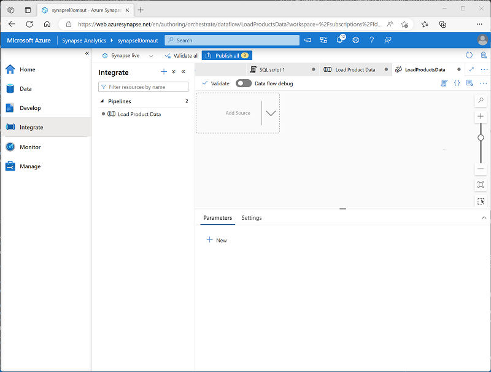

---
lab:
  title: Créer un pipeline de données dans Azure Synapse Analytics
  ilt-use: Lab
---

# Créer un pipeline de données dans Azure Synapse Analytics

Dans cet exercice, vous allez charger des données dans un pool SQL dédié à l’aide d’un pipeline dans l’Explorateur Azure Synapse Analytics. Le pipeline encapsule un flux de données qui charge les données de produit dans une table d’un entrepôt de données.

Cet exercice devrait prendre environ **45** minutes

## Avant de commencer

Vous avez besoin d’un [abonnement Azure](https://azure.microsoft.com/free) dans lequel vous avez un accès administratif.

## Provisionner un espace de travail Azure Synapse Analytics

Vous aurez besoin d’un espace de travail Azure Synapse Analytics avec accès au stockage data lake et à un pool SQL dédié hébergeant un entrepôt de données relationnelle.

Dans cet exercice, vous allez utiliser une combinaison d’un script PowerShell et d’un modèle ARM pour approvisionner un espace de travail Azure Synapse Analytics.

1. Connectez-vous au [portail Azure](https://portal.azure.com) à l’adresse `https://portal.azure.com`.
2. Utilisez le bouton **[\>_]** à droite de la barre de recherche, en haut de la page, pour créer un environnement Cloud Shell dans le portail Azure, en sélectionnant un environnement ***Bash*** et en créant le stockage si vous y êtes invité. Cloud Shell fournit une interface de ligne de commande dans un volet situé en bas du portail Azure, comme illustré ici :

    

    > **Remarque** : Si vous avez créé un interpréteur de commandes cloud qui utilise un *environnement Bash* , utilisez le menu déroulant en haut à gauche du volet Cloud Shell pour le remplacer par ***PowerShell***.

3. Notez que vous pouvez redimensionner le volet Cloud Shell en faisant glisser la barre de séparation en haut du volet. Vous pouvez aussi utiliser les icônes &#8212; , &#9723; et X situées en haut à droite du volet pour réduire, agrandir et fermer le volet. Pour plus d’informations sur l’utilisation d’Azure Cloud Shell, consultez la [documentation Azure Cloud Shell](https://docs.microsoft.com/azure/cloud-shell/overview).

4. Dans le terminal, entrez les commandes suivantes pour cloner ce dépôt :

    ```powershell
    rm -r dp-203 -f
    git clone https://github.com/MicrosoftLearning/dp-203-azure-data-engineer dp-203
    ```

5. Une fois que le dépôt a été cloné, entrez les commandes suivantes pour accéder au dossier de ce labo et exécutez le script **setup.sh** qu’il contient :

    ```powershell
    cd dp-203/Allfiles/labs/10
    ./setup.ps1
    ```

6. Si vous y êtes invité, choisissez l’abonnement que vous souhaitez utiliser (cela se produit uniquement si vous avez accès à plusieurs abonnements Azure).
7. Lorsque vous y êtes invité, entrez un mot de passe approprié à définir pour votre pool Azure Synapse SQL.

    > Veillez à le mémoriser.

8. Attendez que le script se termine, ce qui prend généralement entre 5 et 10 minutes. Pendant que vous attendez, passez en revue les [flux de données dans l’article Azure Synapse Analytics](https://learn.microsoft.com/azure/synapse-analytics/concepts-data-flow-overview) dans la documentation Azure Synapse Analytics.

## Préparer les magasins de données source et de destination.

Les données sources de cet exercice sont un fichier texte contenant des données de produit. La destination est une table dans un pool SQL dédié. Votre objectif est de créer un pipeline qui encapsule un flux de données dans lequel les données de produit du fichier sont chargées dans la table ; insertion de nouveaux produits et mise à jour des produits existants.

1. Une fois le script terminé, dans le Portail Azure, accédez au **groupe de ressources dp203-*xxxxxxx*** qu’il a créé, puis sélectionnez votre espace de travail Synapse.
2. Dans la **page Vue d’ensemble** de votre espace de travail Synapse, dans l’carte **Ouvrir Synapse Studio**, sélectionnez **Ouvrir** pour ouvrir Synapse Studio dans un nouvel onglet de navigateur ; connectez-vous si vous y êtes invité.
3. Sur le côté gauche de Synapse Studio, utilisez l’icône ›› pour développer le menu. Cela permet d’afficher les différentes pages de Synapse Studio qui vous permettront de gérer les ressources et d’effectuer des tâches d’analytique données
4. Dans la **page Gérer** , sous l’onglet **Pools** SQL, sélectionnez la ligne du **pool SQL dédié sql*xxxxxxx*** et utilisez son **icône &#9655 ;** pour le démarrer ; confirmez que vous souhaitez le reprendre lorsque vous y êtes invité.

     La reprise d’un pool peut prendre plusieurs minutes. Vous pouvez utiliser le **&#8635 ; Bouton Actualiser** pour case activée son état régulièrement. L’état s’affiche en ligne **** quand il est prêt. Pendant que vous attendez, suivez les étapes ci-dessous pour afficher les données sources.

5. Dans la **page Données**, affichez l’onglet **Lié** et vérifiez que votre espace de travail inclut un lien vers votre compte de stockage Azure Data Lake Stockage Gen2, qui doit avoir un nom similaire à **synapse*xxxxxxx* (Primary - datalake*xxxxxxx*)**.
6. Développez votre compte de stockage et vérifiez qu’il contient un conteneur de système de fichiers nommé **fichiers (principal)** .
7. Sélectionnez le conteneur de fichiers, puis notez qu’il contient un dossier nommé **données**.
8. Ouvrez le **dossier de données** et observez le **fichier Product.csv** qu’il contient.
9. Cliquez avec le bouton droit sur **Product.csv** et sélectionnez **Aperçu** pour afficher les données qu’il contient. Notez qu’il contient une ligne d’en-tête et certains enregistrements de données de produit.
10. Revenez à la **page Gérer** et vérifiez que votre pool SQL dédié est désormais en ligne. Si ce n’est pas le cas, attendez-le.
11. Dans la **page Données** , sous l’onglet **Espace de travail** , développez **la base de données** SQL, votre **base de données sql*xxxxxxx* (SQL)** et ses **tables**.
12. Sélectionnez le **dbo. Table DimProduct** . Ensuite, dans son menu ...** , sélectionnez **Nouveau script** > **SQL Sélectionner les 100 lignes** TOP 100 ; qui exécute une requête qui retourne les données de produit à partir de la table , il doit y avoir une seule ligne.**

## Implémenter des pipelines

Pour charger les données du fichier texte dans la table de base de données, vous allez implémenter un pipeline Azure Synapse Analytics qui contient une encapsulation de flux de données pour ingérer les données à partir du fichier texte, rechercher la colonne ProductKey** de substitution **pour les produits qui existent déjà dans la base de données, puis insérer ou mettre à jour des lignes dans la table en conséquence.

### Créer un pipeline avec une activité de flux de données

1. Dans Synapse Studio, sélectionnez la page **Données**. Ensuite, dans le **+** menu, sélectionnez **Pipeline** pour créer un pipeline.
2. Dans le **volet Propriétés** de votre nouveau pipeline, remplacez son nom de **Pipeline1** pour **charger des données** de produit. Utilisez ensuite le **bouton Propriétés au-dessus du volet Propriétés**** pour le **masquer.
3. Dans le **volet Activités** , développez **Déplacer et transformer**, puis faites glisser un **flux** de données vers l’aire de conception du pipeline, comme illustré ici :

    

4. Sous l’aire de conception du pipeline, sous l’onglet **Général** , définissez la **propriété Name** sur **LoadProducts**.
5. Sous l’onglet **Paramètres**, en bas de la liste des paramètres, développez **Préproduction** et définissez les paramètres intermédiaires suivants :
    - **Service lié intermédiaire : sélectionnez le **service** lié synapse*xxxxxxx-WorkspaceDefault* Stockage** service lié.
    - **Dossier** de stockage intermédiaire : définissez le **conteneur** sur **les fichiers** et **le répertoire** sur **stage_products**.

### Configurer des flux de données

1. En haut de l’onglet Paramètres pour le **flux de données LoadProducts**, pour la **propriété de flux** de données, sélectionnez **+ Nouveau**.** **
2. Dans le **volet Propriétés** de la nouvelle surface de conception de flux de données qui s’ouvre, définissez le **nom** sur **LoadProductsData** , puis masquez le **volet Propriétés** . Le concepteur de flux de données doit ressembler à ceci :

    

### Ajouter des sources

1. Dans l’aire de conception du flux de données, dans la **liste déroulante Ajouter une source** , sélectionnez **Ajouter une source**. Configurez les paramètres sources comme suit :
    - **Nom** du flux de sortie : ProductsText
    - **Description** : Données texte des produits
    - **Type de source** : jeu de données d’intégration
    - **Jeu de données** : Ajoutez un **nouveau** jeu de données avec les propriétés suivantes :
        - **Questions fréquentes (FAQ) - Azure Data Lake Storage Gen2**
        - **Format de texte délimité**
        - **Nom** : Products_Csv
        - **Service** lié : synapse*xxxxxxx-WorkspaceDefault* Stockage
        - **Chemin d’accès au** fichier : fichiers/data/Product.csv
        - **Première ligne comme en-tête** : Sélectionné
        - Importez le schéma à partir de la connexion/du magasin.
    - **Autoriser la dérive** de schéma : sélectionné
2. Sous l’onglet **Projection** de la nouvelle **source ProductsText** , définissez les types de données suivants :
    - [ProductID: string.
    - - ProductName (string)
    - **Couleur** : chaîne
    - size (string)
    - **ListPrice** : décimale
    - **Discontinued** : boolean
3. Ajoutez une deuxième propriété avec les valeurs suivantes :
    - **Nom** du flux de sortie : ProductTable
    - **Description** : Table produit
    - **Type de source** : jeu de données d’intégration
    - **Jeu de données** : Ajoutez un **nouveau** jeu de données avec les propriétés suivantes :
        - **Pour Azure Synapse Analytics** :
        - **Nom** : DimProduct
        - **Service** lié : Créez un** **service lié avec les propriétés suivantes :
            - **Nom** : Data_Warehouse
            - **Description** : Pool SQL dédié
            - **Se connecter via un runtime d'intégration** : AutoResolveIntegrationRuntime
            - **Méthode de sélection du compte** : À partir de l’abonnement
            - Dans Abonnement Azure, sélectionnez votre abonnement Azure.
            - **Nom** du serveur : synapse*xxxxxxx* (espace de travail Synapse)
            - **Nom** de la base de données : sql*xxxxxxx*
            - **Pool** SQL : type** d’authentification sql*xxxxxxx*
            **: Identité managée affectée par le système
        - **Nom** de la table : dbo. DimProduct
        - Importez le schéma à partir de la connexion/du magasin.
    - **Autoriser la dérive** de schéma : sélectionné
4. Sous l’onglet **Projection** de la nouvelle **source ProductTable** , vérifiez que les types de données suivants sont définis :
    - **ProductKey** : entier
    - **ProductAltKey** : chaîne
    - - ProductName (string)
    - **Couleur** : chaîne
    - size (string)
    - **ListPrice** : décimale
    - **Discontinued** : boolean
5. Vérifiez que votre flux de données contient deux sources, comme indiqué ici :

    

### Ajouter une recherche

1. Sélectionnez l’icône en bas à droite de la **source ProductsText**, puis sélectionnez **Recherche**.**+**
2. Configurez les paramètres de colonne comme suit :
    - **Nom** du flux de sortie : MatchedProducts
    - **Description** : Données de produit mises en correspondance
    - **Flux** principal : ProductText
    - **Flux** de recherche : ProductTable
    - **Mettre en correspondance plusieurs lignes** : <u>Non</u>sélectionné
    - **Correspondance sur** : Dernière ligne
    - **Conditions** de tri : ProductKey croissant
    - **Conditions** de recherche : ProductID == ProductAltKey
3. Vérifiez que votre flux de données ressemble à ceci :

    

    La recherche retourne un ensemble de colonnes des *deux* sources, formant essentiellement une jointure externe qui correspond à la **colonne ProductID** du fichier texte à la **colonne ProductAltKey** dans la table de l’entrepôt de données. Lorsqu’un produit avec la clé alternative existe déjà dans la table, le jeu de données inclut les valeurs des deux sources. Lorsque le produit n’existe pas déjà dans l’entrepôt de données, le jeu de données contient des valeurs NULL pour les colonnes de table.

### Ajouter une modification d’enregistrement

1. Sélectionnez l’icône en bas à droite de la **recherche MatchedProducts**, puis sélectionnez **Alter Row**.**+**
2. Configurez les paramètres de colonne comme suit :
    - **Nom** du flux de sortie : SetLoadAction
    - **Description** : Insérer un nouveau upsert existant
    - **Flux** entrant : MatchedProducts
    - **Modifier les conditions** de ligne : modifiez la condition existante et utilisez le ****+bouton pour ajouter une deuxième condition comme suit (notez que les expressions respectent *la casse*) :
        - InsertIf : `isNull(ProductKey)`
        - UpsertIf : `not(isNull(ProductKey))`
3. vérifiez que le flux de données ressemble à ceci :

    

    L’étape de modification de ligne configure le type d’action de chargement à effectuer pour chaque ligne. Là où il n’existe aucune ligne existante dans la table ( **ProductKey** est NULL), la ligne du fichier texte est insérée. Là où il existe déjà une ligne pour le produit, un *upsert* est effectué pour mettre à jour la ligne existante. Cette configuration applique essentiellement une *mise à jour* de dimension à variation lente de type 1.

### Ajouter un récepteur

1. Sélectionnez l’icône en bas à droite de l’étape **de modification de ligne SetLoadAction**, puis sélectionnez **Récepteur**.**+**
2. Configurez les propriétés comme suit :
    - **Nom** du flux de sortie : DimProductTable
    - **Description** : Charger la table DimProduct
    - **Flux** entrant : SetLoadAction
    - **Type de** récepteur : jeu de données d’intégration
    - **Jeu de données** : DimProduct
    - **Autoriser la dérive** de schéma : sélectionné
3. Sous l’onglet **Paramètres** du nouveau **récepteur DimProductTable**, spécifiez les paramètres suivants :
    - **** Méthode de mise à jour : sélectionnez **Autoriser l’insertion** et **Autoriser upsert**.
    - **** Colonnes clés : sélectionnez **la liste des colonnes**, puis sélectionnez la **colonne ProductAltKey**.
4. Sous l’onglet **Mappages** pour le nouveau **récepteur DimProductTable**, désactivez le **mappage** automatique case activée box et spécifiez <u>uniquement</u> les mappages de colonnes suivants :
    - ProductID : ProductAltKey
    - ProductName
    - Couleur
    - Taille de ProductsText@Size:
    - ListPrice
    - Abandonné
5. Vérifiez que votre flux de données ressemble à ceci :

    

## Débogage d’un flux de données

Maintenant que vous avez créé un flux de données dans un pipeline, vous pouvez le déboguer avant la publication.

1. En haut du concepteur de flux de données, le débogage** de flux de données est activé**. Passez en revue la configuration par défaut et sélectionnez **OK**, puis attendez que le cluster de débogage démarre (ce qui peut prendre quelques minutes).
2. Dans le concepteur de flux de données, sélectionnez le **récepteur DimProductTable** et affichez son **onglet Aperçu des données** .
3. Utilisez le **fichier &#8635 ; Bouton Actualiser** pour actualiser l’aperçu, qui a l’effet d’exécuter des données via le flux de données pour le déboguer.
4. Passez en revue les données d’aperçu, en notant qu’il indique une ligne upserted (pour le produit AR5381 existant *), indiquée par une<sup><sub></sub>*****</sup>+ icône ; et dix lignes insérées, indiquées par une ****+icône.*

## Publier et exécuter un pipeline

Vous êtes maintenant prêt à créer et exécuter un pipeline.

1. Utilisez le **bouton Publier tout** pour publier le pipeline (et toutes les autres ressources non enregistrées).
2. Une fois la publication terminée, fermez le **volet de flux de données LoadProductsData** et revenez au volet Charger les **données** du produit.
3. En haut du volet concepteur de pipelines, dans le **menu Ajouter un déclencheur** , sélectionnez **Déclencheur maintenant**. **Sélectionnez ENSUITE OK** pour confirmer que vous souhaitez exécuter le pipeline.

    **Remarque** : vous pouvez également créer un déclencheur pour exécuter le pipeline à un moment planifié ou en réponse à un événement spécifique.

4. Lorsque le pipeline a commencé à s’exécuter, dans la **page Moniteur** , affichez l’onglet **Exécutions** du pipeline et passez en revue l’état du pipeline Charger les **données** du produit.

    Le pipeline peut prendre cinq minutes ou plus longtemps. Vous pouvez utiliser le **&#8635 ; Bouton Actualiser** dans la barre d’outils pour case activée son état.

5. Lorsque l’exécution du pipeline a réussi, dans la **page Données** , utilisez le **menu ...** pour le **dbo. Table DimProduct** dans votre base de données SQL pour exécuter une requête qui sélectionne les 100 premières lignes. La table doit contenir les données chargées par le pipeline.
   
## Supprimer les ressources Azure

Si vous avez fini d’explorer Azure Synapse Analytics, vous devriez supprimer les ressources que vous avez créées afin d’éviter des coûts Azure inutiles.

1. Fermez l’onglet du navigateur Synapse Studio et revenez dans le portail Azure.
2. Dans le portail Azure, dans la page **Accueil**, sélectionnez **Groupes de ressources**.
3. Sélectionnez le groupe de ressources pour votre espace de travail Synapse Analytics (et non le groupe de ressources managé) et vérifiez qu’il contient l’espace de travail Synapse, le compte de stockage et le pool Spark pour votre espace de travail.
4. Au sommet de la page **Vue d’ensemble** de votre groupe de ressources, sélectionnez **Supprimer le groupe de ressources**.
5. Entrez le nom du groupe de ressources pour confirmer que vous souhaitez le supprimer, puis sélectionnez Supprimer.

    Après quelques minutes, votre espace de travail Azure Synapse et l’espace de travail managé qui lui est associé seront supprimés.
