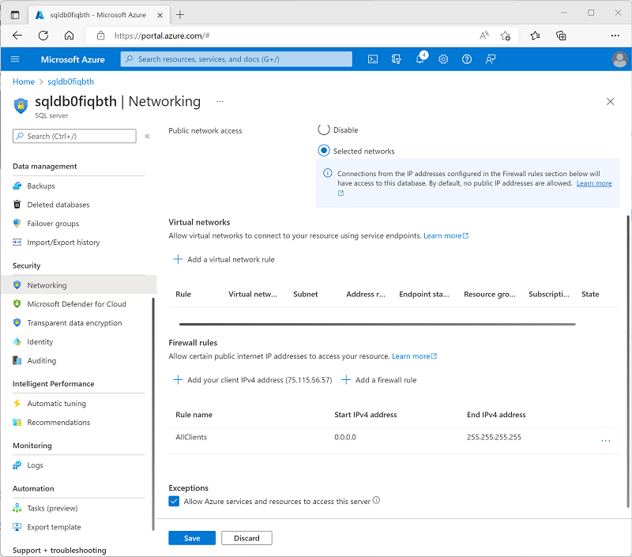

---
lab:
  title: Utiliser Azure Synapse Link pour SQL
  ilt-use: Suggested demo
---

# Utiliser Azure Synapse Link pour SQL

Azure Synapse Link pour SQL vous permet de synchroniser automatiquement une base de données transactionnelle dans SQL Server ou Azure SQL Database avec un pool SQL dédié dans Azure Synapse Analytics. Cette synchronisation vous permet d’effectuer des charges de travail analytiques à faible latence dans Synapse Analytics sans entraîner une surcharge de requêtes dans la base de données opérationnelle source.

Cet exercice devrait prendre environ **35** minutes.

## Avant de commencer

Vous avez besoin d’un [abonnement Azure](https://azure.microsoft.com/free) dans lequel vous avez un accès administratif.

## Approvisionner des ressources Azure

Dans cet exercice, vous allez synchroniser les données d’une ressource Azure SQL Database sur un espace de travail Azure Synapse Analytics. Vous allez commencer par utiliser un script pour approvisionner ces ressources dans votre abonnement Azure.

1. Connectez-vous au [portail Azure](https://portal.azure.com) à l’adresse `https://portal.azure.com`.
2. Utilisez le bouton **[\>_]** à droite de la barre de recherche, en haut de la page, pour créer un environnement Cloud Shell dans le portail Azure, puis sélectionnez un environnement ***PowerShell*** et créez le stockage si vous y êtes invité. Cloud Shell fournit une interface de ligne de commande dans un volet situé en bas du portail Azure, comme illustré ici :

    

    > **Remarque** : si vous avez créé un shell cloud qui utilise un environnement *Bash*, utilisez le menu déroulant en haut à gauche du volet Cloud Shell pour le remplacer par ***PowerShell***.

3. Notez que vous pouvez redimensionner le volet Cloud Shell en faisant glisser la barre de séparation en haut du volet. Vous pouvez aussi utiliser les icônes **&#8212;** , **&#9723;** et **X** situées en haut à droite du volet pour réduire, agrandir et fermer le volet. Pour plus d’informations sur l’utilisation d’Azure Cloud Shell, consultez la [documentation Azure Cloud Shell](https://docs.microsoft.com/azure/cloud-shell/overview).

4. Dans le volet PowerShell, entrez les commandes suivantes pour cloner ce référentiel :

    ```
    rm -r dp-203 -f
    git clone https://github.com/MicrosoftLearning/dp-203-azure-data-engineer dp-203
    ```

5. Une fois que le référentiel a été cloné, entrez les commandes suivantes pour accéder au dossier de cet exercice et exécutez le script **setup.ps1** qu’il contient :

    ```
    cd dp-203/Allfiles/labs/15
    ./setup.ps1
    ```

6. Si vous y êtes invité, choisissez l’abonnement à utiliser (uniquement si vous avez accès à plusieurs abonnements Azure).
7. Lorsque vous y êtes invité, entrez un mot de passe approprié pour votre Azure SQL Database.

    > **Remarque** : veillez à mémoriser ce mot de passe.

8. Attendez que le script se termine. Cela prend généralement environ 15 minutes, mais dans certains cas, cela peut prendre plus de temps. Pendant que vous attendez, consultez l’article [Qu’est-ce qu’Azure Synapse Link pour SQL ?](https://docs.microsoft.com/azure/synapse-analytics/synapse-link/sql-synapse-link-overview) dans la documentation Azure Synapse Analytics.

## Configurer Azure SQL Database

Avant de pouvoir configurer Azure Synapse Link pour votre Azure SQL Database, vous devez vous assurer que les paramètres de configuration requis ont été appliqués dans votre serveur Azure SQL Database.

1. Dans le [portail Azure](https://portal.azure.com), accédez au groupe de ressources **dp203-*xxxxxxx*** créé par le script d’installation, puis sélectionnez votre Azure SQL Server **sqldb*xxxxxxxx***.

    > **Remarque** : veillez à ne pas combiner la ressource Azure SQL Server **sqldb*xxxxxxxx****) et le pool SQL dédié Azure Synapse Analytics (** sql*xxxxxxxx***).

2. Dans la page de votre ressource Azure SQL Server, dans le volet à gauche, dans la section **Sécurité** (en bas), sélectionnez **Identité**. Ensuite, sous **Identité managée affectée par le système**, définissez l’option **État** sur **Activé**. Utilisez ensuite l’icône ** Enregistrer** pour enregistrer votre modification de configuration.

    

3. Dans le volet à gauche, dans la section **Sécurité**, sélectionnez **Mise en réseau**. Ensuite, sous **Règles de pare-feu**, sélectionnez l’exception pour **Autoriser les services et les ressources Azure à accéder à ce serveur**.

4. Utiliser le bouton **＋ Ajouter une règle de pare-feu** pour ajouter une nouvelle règle de pare-feu avec les paramètres suivants :

    | Nom de la règle | Adresse IP de début | Adresse IP de fin |
    | -- | -- | -- |
    | AllClients | 0.0.0.0 | 255.255.255.255 |

    > **Remarque** : cette règle autorise l’accès à votre serveur à partir de n’importe quel ordinateur connecté à Internet. Nous le permettons dans le but de simplifier l’exercice, mais dans un scénario de production, vous devez restreindre l’accès aux adresses réseau qui doivent utiliser vos bases de données uniquement.

5. Utilisez le bouton **Enregistrer** pour enregistrer les modifications apportées à la configuration :

    

## Explorer la base de données transactionnelle

Votre Azure SQL Server héberge un exemple de base de données nommé **AdventureWorksLT**. Cette base de données représente une base de données transactionnelle utilisée pour les données d’application opérationnelles.

1. Dans la page **Vue d’ensemble** de votre Azure SQL Server, en bas de la page, sélectionnez la base de données **AdventureWorksLT** :
2. Dans la page de la base de données **AdventureWorksLT**, sélectionnez l’onglet **Éditeur de requête** et connectez-vous à l’aide de l’authentification SQL Server avec les informations d’identification suivantes :
    - **Connexion** SQLUser
    - **Mot de passe** : *mot de passe que vous avez spécifié lors de l’exécution du script d’installation.*
3. Lorsque l’éditeur de requête s’ouvre, développez le nœud **Tables** et affichez la liste des tables dans la base de données. Notez qu’ils incluent des tables dans un schéma **SalesLT** (par exemple, **SalesLT.Customer**).

## Configurer Azure Synapse Link

Vous êtes maintenant prêt à configurer Azure Synapse Link pour SQL dans votre espace de travail Synapse Analytics.

### Démarrer le pool SQL dédié

1. Sur le portail Azure, fermez l’éditeur de requête de votre base de données Azure SQL (en supprimant les modifications) et revenez à la page de votre groupe de ressources **dp203-*xxxxxxx***.
2. Ouvrez l’espace de travail Sypnase **synapse*xxxxxxx*** et, dans sa page **Vue d’ensemble**, sur la fiche **Ouvrir Synapse Studio**, sélectionnez **Ouvrir** pour ouvrir Synapse Studio dans un nouvel onglet de navigateur ; connectez-vous si vous y êtes invité.
3. Sur le côté gauche de Synapse Studio, utilisez l’icône **&rsaquo;&rsaquo;** pour développer le menu. Cela permet d’afficher les différentes pages de Synapse Studio.
4. Sur la page **Gérer**, sous l’onglet **Pools SQL**, sélectionnez la ligne du pool SQL dédié **sql*xxxxxxx*** et utilisez l’icône **▷** correspondante pour le démarrer. Confirmez si vous souhaitez le reprendre lorsque vous y êtes invité.
5. Veuillez patienter jusqu’à la reprise du pool SQL. Cette opération peut prendre quelques minutes. Vous pouvez utiliser le bouton **↻ Actualiser** pour vérifier régulièrement son statut. Le statut **En ligne** apparaît lorsqu’il est prêt.

### Créer le schéma cible

1. Dans Synapse Studio, sur la page **Données**, sous l’onglet **Espace de travail**, développez les **bases de données SQL** et sélectionnez votre base de données **sql*xxxxxxx***.
2. Dans le menu **...** de la base de données **sql*xxxxxxx***, sélectionnez **Nouveau script SQL** > **Script vide**.
3. Dans le volet **Script SQL  1**, entrez le code SQL suivant et utilisez le bouton **▷ Exécuter** pour l’exécuter.

    ```sql
    CREATE SCHEMA SalesLT;
    GO
    ```

4. Veuillez patienter jusqu’à la fin de l’opération. Ce code crée un schéma nommé **SalesLT** dans la base de données pour votre pool SQL dédié, ce qui vous permet de synchroniser les tables dans le schéma de ce nom à partir de votre base de données SQL Azure.

### Créer une connexion de liaison

1. Dans Synapse Studio, sur la page **Intégrer**, dans le menu déroulant **＋**, sélectionnez **Lier la connexion**. Créez ensuite une connexion liée avec les paramètres suivants :
    - **Type de source** : base de données SQL Azure.
    - **Service lié à la source** : ajoutez un nouveau service lié avec les paramètres suivants (un nouvel onglet sera affiché) :
        - **Nom** : SqlAdventureWorksLT.
        - **Description** : Connexion à la base de données AdventureWorksLT
        - **Se connecter via un runtime d'intégration** : AutoResolveIntegrationRuntime
        - **Version** : Ancien
        - **Chaîne de connexion** :sélectionné.
        - **À partir de l’abonnement Azure** : sélectionné
        - **Abonnement Azure** : *sélectionnez votre abonnement Azure.*
        - **Nom du serveur** : *sélectionnez votre serveur SQL Azure **sqldbxxxxxxx**.*
        - **Nom de la base de données** : AdventureWorksLT
        - **Type d’authentification** : Authentification SQL
        - **Nom d'utilisateur** : SQLUser
        - **Mot de passe** : *mot de passe que vous définissez lors de l'exécution du script d'installation.*

        *Utilisez l’option **Tester la connexion** pour vérifier si vos paramètres de connexion sont corrects avant de continuer. Ensuite, cliquez sur **Créer**.*

    - **Tables sources** : Sélectionnez les tables suivantes :
        - **SalesLT.Customer**
        - **SalesLT.Product**
        - **SalesLT.SalesOrderDetail**
        - **SalesLT.SalesOrderHeader**

        *Continuez à configurer les paramètres suivants :*

    > **Remarque :** certaines tables cibles indiquent une erreur due à l’utilisation de types de données personnalisés ou à l’incompatibilité des données de la table source avec le type de structure par défaut de l’*index columnstore clusterisé*.

    - **Pool cible** : *sélectionnez votre pool SQL dédié **sqlxxxxxxx**.*

        *Continuez à configurer les paramètres suivants :*

    - **Nom de la connexion de lien** : sql-adventureworkslt-conn.
    - **Nombre de cœurs** : 4 (+4 cœurs de pilote).

2. Sur la page **sql-adventureworkslt-conn** créée, affichez les mappages de tables qui ont été créés. Vous pouvez utiliser le bouton **Propriétés** (qui ressemble à **<sub>*</sub>**) pour masquer le volet **Propriétés** pour faciliter l’affichage de tous les éléments. 

3. Modifiez ces types de structures dans les mappages de tables comme suit :

    | Table source | Table cible | Type de répartition | Colonne de distribution | Type de structure |
    |--|--|--|--|--|
    | SalesLT.Customer **→** | \[SalesLT] . \[Customer] | Tourniquet (round robin) | - | Index columnstore cluster |
    | SalesLT.Product **→** | \[SalesLT] . \[Product] | Tourniquet (round robin) | - | Segment de mémoire (heap) |
    | SalesLT.SalesOrderDetail **→** | \[SalesLT] . \[SalesOrderDetail] | Tourniquet (round robin) | - | Index columnstore cluster |
    | SalesLT.SalesOrderHeader **→** | \[SalesLT] . \[SalesOrderHeader] | Tourniquet (round robin) | - | Segment de mémoire (heap) |

4. En haut de la page **sql-adventureworkslt-conn** créée, utilisez le bouton **▷ Démarrer** pour démarrer la synchronisation. Quand vous y êtes invité, sélectionnez **OK** pour publier et démarrer la connexion de lien.
5. Après avoir démarré la connexion, dans la page **Superviser**, affichez l’onglet **Connexions de liens**, puis sélectionnez la connexion **sql-adventureworkslt-conn**. Vous pouvez utiliser régulièrement le bouton **↻ Actualiser** pour mettre à jour l’état. L’exécution du processus initial de copie d’instantané et le démarrage de la réplication peuvent prendre plusieurs minutes. Ensuite, toutes les modifications apportées aux tables de base de données source sont automatiquement répercutées dans les tables synchronisées.

### Afficher les données répliquées

1. Une fois que l’état des tables est **En cours d’exécution**, sélectionnez la page **Données** et utilisez l’icône **↻** en haut à droite pour actualiser l’affichage.
2. Sous l’onglet **Espace de travail**, développez **Bases de données SQL**, votre base de données **sql*xxxxxxx*** et son dossier **Tables** pour afficher les tables répliquées.
3. Dans le menu **...** de la base de données **sql*xxxxxxx***, sélectionnez **Nouveau script SQL** > **Script vide**. Ensuite, dans la page du nouveau script, entrez le code SQL suivant :

    ```sql
    SELECT  oh.SalesOrderID, oh.OrderDate,
            p.ProductNumber, p.Color, p.Size,
            c.EmailAddress AS CustomerEmail,
            od.OrderQty, od.UnitPrice
    FROM SalesLT.SalesOrderHeader AS oh
    JOIN SalesLT.SalesOrderDetail AS od 
        ON oh.SalesOrderID = od.SalesOrderID
    JOIN  SalesLT.Product AS p 
        ON od.ProductID = p.ProductID
    JOIN SalesLT.Customer as c
        ON oh.CustomerID = c.CustomerID
    ORDER BY oh.SalesOrderID;
    ```

4. Utilisez le bouton **▷ Exécuter** pour exécuter le script et afficher les résultats. La requête est exécutée sur les tables répliquées dans le pool SQL dédié et non sur la base de données source, ce qui vous permet d’exécuter des requêtes analytiques sans impact sur les applications métier.
5. Quand vous avez terminé, dans la page **Gérer**, suspendez le pool SQL dédié **sql*xxxxxxx***.

## Supprimer les ressources Azure

Si vous avez fini d’explorer Azure Synapse Analytics, vous devriez supprimer les ressources que vous avez créées afin d’éviter des coûts Azure inutiles.

1. Fermez l’onglet du navigateur Synapse Studio et revenez dans le portail Azure.
2. Dans le portail Azure, dans la page **Accueil**, sélectionnez **Groupes de ressources**.
3. Sélectionnez le groupe de ressources **dp203-*xxxxxxx*** créé par le script d’installation au début de cet exercice.
4. Au sommet de la page **Vue d’ensemble** de votre groupe de ressources, sélectionnez **Supprimer le groupe de ressources**.
5. Entrez le nom du groupe de ressources **dp203-*xxxxxxx*** pour confirmer que vous souhaitez le supprimer, puis sélectionnez **Supprimer**.

    Après quelques minutes, le groupe de ressources et les ressources qu’il contient sont supprimés.
