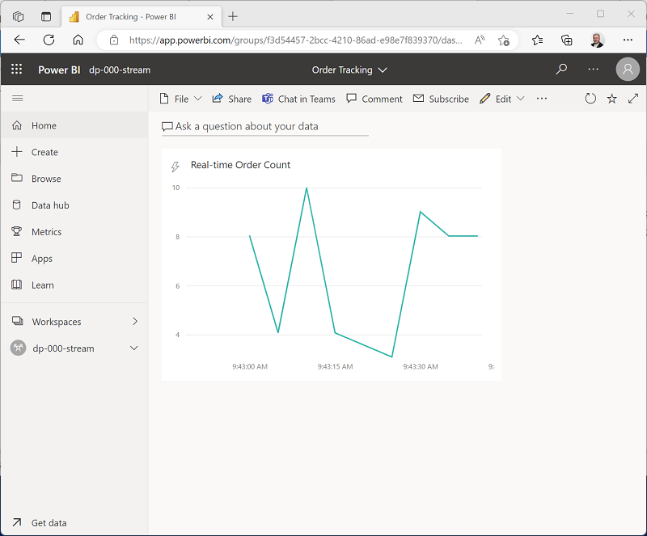

---
lab:
  title: Créer un rapport en temps réel avec Azure Stream Analytics et Microsoft Power BI
  ilt-use: Suggested demo
---

# Créer un rapport en temps réel avec Azure Stream Analytics et Microsoft Power BI

Les solutions d’analytique des données incluent souvent une exigence d’ingestion et de traitement *des flux* de données. Le traitement des flux diffère du traitement par lots en ce sens que les flux sont généralement *sans limite*, en d’autres termes, il s’agit de sources continues de données qui doivent être traitées perpétuellement plutôt qu’à intervalles fixes.

Azure Stream Analytics fournit un service cloud que vous pouvez utiliser pour définir une *requête* qui fonctionne sur un flux de données à partir d’une source de streaming, comme Azure Event Hubs ou Azure IoT Hub. Vous pouvez utiliser une requête Azure Stream Analytics pour traiter un flux de données et envoyer les résultats directement dans Microsoft Power BI pour obtenir des visualisations en temps réel.

Dans cet exercice, vous allez utiliser Azure Stream Analytics pour traiter un flux de données de commandes, qui peut être généré à partir d’une application de vente au détail en ligne, par exemple. Les données de commande sont envoyées au service Azure Event Hubs dans lequel votre travail Azure Stream Analytics va lire et résumer les données avant de les envoyer à Power BI où vous allez visualiser les données dans un rapport.

Cet exercice devrait prendre environ **45** minutes.

## Avant de commencer

Vous avez besoin d’un [abonnement Azure](https://azure.microsoft.com/free) dans lequel vous avez un accès administratif.

Vous aurez également besoin d’un accès au service Microsoft Power BI. Votre établissement scolaire ou votre organisation peut déjà fournir cet accès, ou vous pouvez vous [inscrire au service Power BI en tant qu’individu](https://learn.microsoft.com/power-bi/fundamentals/service-self-service-signup-for-power-bi).

## Approvisionner des ressources Azure

Dans cet exercice, vous aurez besoin d’un espace de travail Azure Synapse Analytics avec accès au stockage Data Lake et d’un pool SQL dédié. Vous aurez également besoin d’un espace de noms Azure Event Hubs dans lequel les données de diffusion de commandes en continu peuvent être envoyées.

Vous allez utiliser la combinaison d’un script PowerShell et d’un modèle ARM pour approvisionner ces ressources.

1. Connectez-vous au [portail Azure](https://portal.azure.com) à l’adresse `https://portal.azure.com`.
2. Utilisez le bouton **[\>_]** à droite de la barre de recherche, en haut de la page, pour créer un environnement Cloud Shell dans le portail Azure, puis sélectionnez un environnement ***PowerShell*** et créez le stockage si vous y êtes invité. Cloud Shell fournit une interface de ligne de commande dans un volet situé en bas du portail Azure, comme illustré ici :

    

    > **Remarque** : si vous avez créé un shell cloud qui utilise un environnement *Bash*, utilisez le menu déroulant en haut à gauche du volet Cloud Shell pour le remplacer par ***PowerShell***.

3. Notez que vous pouvez redimensionner le volet Cloud Shell en faisant glisser la barre de séparation en haut du volet. Vous pouvez aussi utiliser les icônes **&#8212;** , **&#9723;** et **X** situées en haut à droite du volet pour réduire, agrandir et fermer le volet. Pour plus d’informations sur l’utilisation d’Azure Cloud Shell, consultez la [documentation Azure Cloud Shell](https://docs.microsoft.com/azure/cloud-shell/overview).

4. Dans le volet PowerShell, entrez les commandes suivantes pour cloner le référentiel contenant cet exercice :

    ```
    rm -r dp-203 -f
    git clone https://github.com/MicrosoftLearning/dp-203-azure-data-engineer dp-203
    ```

5. Une fois que le référentiel a été cloné, entrez les commandes suivantes pour accéder au dossier de cet exercice et exécutez le script **setup.ps1** qu’il contient :

    ```
    cd dp-203/Allfiles/labs/19
    ./setup.ps1
    ```

6. Si vous y êtes invité, choisissez l’abonnement à utiliser (uniquement si vous avez accès à plusieurs abonnements Azure).

7. Pendant que vous attendez que le script se termine, continuez les autres tâches.

## Création d’un espace de travail Power BI

Dans le service Power BI, vous organisez des jeux de données, des rapports et d’autres ressources dans des *espaces de travail*. Chaque utilisateur de Power BI dispose d’un espace de travail nommé **Mon espace de travail** que vous utilisez dans cet exercice. Cependant, il est généralement conseillé de créer un espace de travail pour chaque solution de reporting discrète que vous souhaitez gérer.

1. Connectez-vous au service Power BI sur [https://app.powerbi.com/](https://app.powerbi.com/) en utilisant les informations d’identification de votre service Power BI.
2. Dans la barre de menus à gauche, sélectionnez **Espaces de travail** (l’icône ressemble à &#128455;).
3. Créez un espace de travail avec un nom significatif (par exemple, *mslearn-streaming*) en sélectionnant le mode de licence **Pro**.

    > **Remarque** : Si vous utilisez un compte d’évaluation gratuite, il est possible que vous deviez activer des fonctionnalité d’essai supplémentaires.

4. Lorsque vous affichez votre espace de travail, notez son identificateur unique (GUID) au niveau global dans l’URL de page (qui doit ressembler à `https://app.powerbi.com/groups/<GUID>/list`). Vous aurez besoin de ce GUID ultérieurement.

## Utiliser Azure Stream Analytics pour traiter des données de diffusion en continu

Un travail Azure Stream Analytics définit une requête perpétuelle qui fonctionne sur les données de diffusion en continu d’une ou de plusieurs entrées et envoie les résultats à une ou plusieurs sorties.

### Création d’un travail Stream Analytics

1. Rebasculez vers l’onglet de navigateur contenant le Portail Azure et, une fois le script terminé, prenez note de la région où votre groupe de ressources **dp203-*xxxxxxx*** a été approvisionné.
2. Dans la page **Accueil** du Portail Azure, sélectionnez **+ Créer une ressource** et recherchez `Stream Analytics job`. Créez ensuite une **Tâche Stream Analytics** avec les propriétés suivantes :
    - **Abonnement** : votre abonnement Azure.
    - **Groupe de ressources** : sélectionnez le groupe de ressources **dp203-*xxxxxxx*** existant.
    - **Nom :** `stream-orders`
    - **Région** : Sélectionnez la région où votre espace de travail Synapse Analytics est approvisionné.
    - **Environnement d’hébergement** : cloud.
    - **Unités de diffusion en continu** : 1.
3. Attendez la fin du déploiement, puis accédez à la ressource de tâche Stream Analytics déployée.

### Créer une entrée pour le flux de données d’événement

1. Sur la page de vue d’ensemble de **stream-orders**, sélectionnez la page **Entrées** et utilisez le menu **Ajouter une entrée** pour ajouter une entrée **Event Hub** avec les propriétés suivantes :
    - **Alias d’entrée** : `orders`.
    - **Sélectionner un Event Hub dans vos abonnements** : sélectionné.
    - **Abonnement** : votre abonnement Azure.
    - **Espace de noms Event Hub** : sélectionnez l’espace de noms Event Hub **events*xxxxxxx***.
    - **Nom de l’Event Hub** : sélectionnez l’Event Hub **eventhub*xxxxxxx*** existant.
    - **Groupe de consommateurs Event Hub** : sélectionner le groupe de consommateurs **$Default** existant.
    - **Mode d’authentification** : créer une identité managée affectée par le système.
    - **Clé de partition** : *laisser vide*.
    - **Format de sérialisation de l’événement** : JSON.
    - **Encodage** : UTF-8
2. Enregistrez l’entrée et attendez qu’elle soit créée. Plusieurs notifications vont s’afficher. Attendez qu’une notification **Test de connexion réussi** s’affiche.

### Créer une sortie pour l’espace de travail Power BI

1. Affichez la page **Sorties** pour le travail Stream Analytics **stream-orders**. Utilisez ensuite le menu **Ajouter une sortie** pour ajouter une sortie **Power BI** avec les propriétés suivantes :
    - **Alias de sortie** : `powerbi-dataset`.
    - **Sélectionnez les paramètres Power BI manuellement** : Sélectionné
    - **Espace de travail de groupe** : *GUID de votre espace de travail*
    - **Mode d'authentification** : *Sélectionnez* **Jeton d’utilisateur** *puis le bouton* **Autoriser** *en bas de l’écran pour vous connecter à votre compte Power BI*
    - **Nom du jeu de données** : `realtime-data`
    - **Nom de table** : `orders`

2. Enregistrez la sortie et attendez qu’elle soit créée. Plusieurs notifications vont s’afficher. Attendez qu’une notification **Test de connexion réussi** s’affiche.

### Créer une requête pour résumer le flux d’événement

1. Affichez la page **Requête** pour le travail Stream Analytics **stream-orders**.
2. Modifiez la requête par défaut de la manière suivante :

    ```
    SELECT
        DateAdd(second,-5,System.TimeStamp) AS StartTime,
        System.TimeStamp AS EndTime,
        ProductID,
        SUM(Quantity) AS Orders
    INTO
        [powerbi-dataset]
    FROM
        [orders] TIMESTAMP BY EventEnqueuedUtcTime
    GROUP BY ProductID, TumblingWindow(second, 5)
    HAVING COUNT(*) > 1
    ```

    Observez que cette requête utilise **System-Timestamp** (basé sur le champ **EventEnqueuedUtcTime**) pour définir le début et la fin de chaque fenêtre *bascule* de 5 secondes (séquentielle sans chevauchement) dans laquelle la quantité totale pour chaque ID de produit est calculée.

3. Enregistrez la requête.

### Exécutez le travail de diffusion en continu pour traiter les données de commande

1. Consultez la page **Vue d’ensemble** pour le travail Stream Analytics **stream-orders**, puis sous l’onglet **Propriétés**, passez en revue les champs **Entrées**, **Requête**, **Sorties** et **Fonctions** pour le travail. Si le nombre d’**Entrées** et de **Sorties** est 0, utilisez le bouton **&#8635; Actualiser** sur la page **Vue d’ensemble** pour afficher l’entrée **commandes** et la sortie **powerbi-dataset**.
2. Sélectionnez le bouton **▷ Démarrer** et démarrez la tâche de diffusion en continu maintenant. Attendez de recevoir la notification indiquant que la tâche de diffusion en continu a démarré avec succès.
3. Rouvrez le volet Cloud Shell et exécutez les commandes suivantes pour envoyer 100 commandes.

    ```
    node ~/dp-203/Allfiles/labs/19/orderclient
    ```

4. Pendant l’exécution de l’application cliente de commandes, basculez vers l’onglet du navigateur d’application Power BI et consultez votre espace de travail.
5. Actualisez la page d’application Power BI jusqu’à ce que le jeu de données **realtime-data** s’affiche dans votre espace de travail. Le jeu de données est généré par le travail Azure Stream Analytics.

## Visualiser les données de diffusion en continu dans Power BI

Maintenant que vous disposez d’un jeu de données pour les données de commande de diffusion en continu, vous pouvez créer un tableau de bord Power BI qui le représente de manière visuelle.

1. Revenez à l’onglet de votre navigateur Power BI.

2. Dans le menu déroulant **+ Nouveau** pour votre espace de travail, sélectionnez **Tableau de bord**, puis créez un tableau de bord nommé **Suivi de commandes**.

3. Dans le tableau de bord **Suivi de commandes**, sélectionnez le menu **&#9999;&#65039; Modifier**, puis **+ Ajouter un fichier**. Ensuite, dans le volet **Ajouter une vignette**, sélectionnez **Données de diffusion en continu personnalisées**, puis **Suivant** :

4. Dans le volet **Ajouter une vignette de données de diffusion en continu personnalisées**, sous **Vos jeux de données**, sélectionnez le jeu de données **realtime-data**, puis **Suivant**.

5. Remplacez le type de visualisation par défaut par **Graphique en courbes**. Définissez ensuite les propriétés suivantes et sélectionnez **Suivant** :
    - **Axe** : EndTime
    - **Valeur** : Orders (Commandes)
    - **Fenêtre de temps à afficher** : 1 minute

6. Sur le volet **Détails de la vignette**, définissez la **Vignette** sur **Nombre de commandes en temps réel**, puis sélectionnez **Appliquer**.

7. Rebasculez vers l’onglet de navigateur contenant le Portail Azure et, le cas échéant, rouvrez le volet Cloud Shell. Exécutez ensuite à nouveau la commande suivante pour soumettre les 100 commandes suivantes.

    ```
    node ~/dp-203/Allfiles/labs/19/orderclient
    ```

8. Quand le script de soumission de commande s’exécute, rebasculez vers l’onglet de navigateur contenant le tableau de bord **Suivi de commandes** de Power BI et notez que la visualisation se met à jour pour refléter les nouvelles données de commande lors de leur traitement par le travail Stream Analytics (qui doit toujours s’exécuter).

    

    Vous pouvez exécuter à nouveau le script **orderclient** et observer les données en cours de capture dans le tableau de bord en temps réel.

## Supprimer des ressources

Si vous avez fini d’explorer Azure Stream Analytics et Power BI, vous devriez supprimer les ressources créées afin d’éviter des coûts Azure inutiles.

1. Fermez l’onglet du navigateur contenant le rapport Power BI. Ensuite, dans le volet **Espaces de travail** du menu **&#8942;** de votre espace de travail, sélectionnez **Paramètres d’espace de travail** et supprimez l’espace de travail.
2. Revenez à l’onglet du navigateur contenant le Portail Azure, fermez le volet Cloud Shell et utilisez le bouton **&#128454; Arrêter** pour arrêter le travail Stream Analytics. Attentez la notification indiquant que le travail Stream Analytics s’est correctement arrêté.
3. Dans le portail Azure, dans la page **Accueil**, sélectionnez **Groupes de ressources**.
4. Sélectionnez le groupe de ressources **dp203-*xxxxxxx*** contenant vos ressources Azure Event Hub et Stream Analytics.
5. Au sommet de la page **Vue d’ensemble** de votre groupe de ressources, sélectionnez **Supprimer le groupe de ressources**.
6. Entrez le nom du groupe de ressources **dp203-*xxxxxxx*** pour confirmer que vous souhaitez le supprimer, puis sélectionnez **Supprimer**.

    Après quelques minutes, les ressources créées dans cet exercice seront supprimées.
