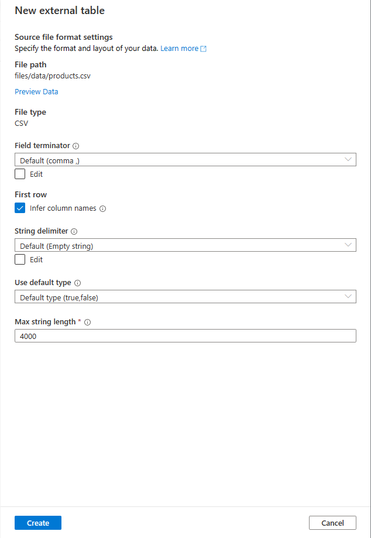
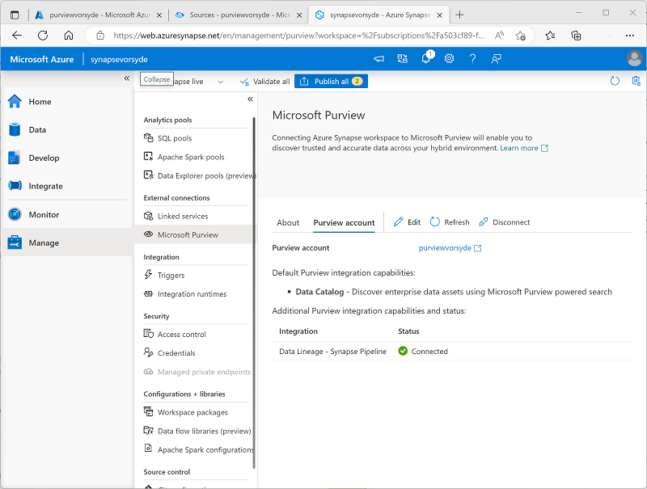

---
lab:
  title: Intégrer Microsoft Purview et Azure Synapse Analytics
  ilt-use: Lab
---

> **Important** : Microsoft Purview a été mis à jour pour limiter le nombre de comptes Microsoft Purview disponibles par locataire Azure. Par conséquent, ce labo n’est pas pris en charge dans les environnements locataires partagés, y compris de nombreux environnements de laboratoire hébergés utilisés dans les cours de formation dirigés par des instructeurs.

# Intégrer Microsoft Purview et Azure Synapse Analytics

Microsoft Purview vous permet de cataloguer des ressources de données dans votre patrimoine de données et de suivre le flux de données à mesure qu’elles sont transférées d’une source de données à une autre , élément clé d’une solution de gouvernance des données complète.

Cet exercice devrait prendre environ **40** minutes.

## Avant de commencer

Vous aurez besoin d’un [abonnement](https://azure.microsoft.com/free) Azure dans lequel vous disposez de privilèges au niveau administratif et d’un accès exclusif au locataire dans lequel l’abonnement est défini.

## Approvisionner des ressources Azure

Dans cet exercice, vous allez utiliser Microsoft Purview pour suivre les ressources et la traçabilité des données dans un espace de travail Azure Synapse Analytics. Vous allez commencer par utiliser un script pour provisionner ces ressources dans votre abonnement Azure.

1. Connectez-vous au [portail Azure](https://portal.azure.com) à l’adresse `https://portal.azure.com`.
2. Utilisez le bouton **[\>_]** à droite de la barre de recherche, en haut de la page, pour créer un environnement Cloud Shell dans le portail Azure, en sélectionnant un environnement ***Bash*** et en créant le stockage si vous y êtes invité. Cloud Shell fournit une interface de ligne de commande dans un volet situé en bas du portail Azure, comme illustré ici :

    

    > **Remarque** : Si vous avez créé un interpréteur de commandes cloud qui utilise un *environnement Bash* , utilisez le menu déroulant en haut à gauche du volet Cloud Shell pour le remplacer par ***PowerShell***.

3. Notez que vous pouvez redimensionner le volet Cloud Shell en faisant glisser la barre de séparation en haut du volet. Vous pouvez aussi utiliser les icônes **&#8212;** , **&#9723;** et **X** situées en haut à droite du volet pour réduire, agrandir et fermer le volet. Pour plus d’informations sur l’utilisation d’Azure Cloud Shell, consultez la [documentation Azure Cloud Shell](https://docs.microsoft.com/azure/cloud-shell/overview).

4. Dans le terminal, entrez les commandes suivantes pour cloner ce dépôt :

    ```
    rm -r dp-203 -f
    git clone https://github.com/MicrosoftLearning/dp-203-azure-data-engineer dp-203
    ```

5. Une fois que le dépôt a été cloné, entrez les commandes suivantes pour accéder au dossier de ce labo et exécutez le script **setup.sh** qu’il contient :

    ```
    cd dp-203/Allfiles/labs/22
    ./setup.ps1
    ```

6. Si vous y êtes invité, choisissez l’abonnement que vous souhaitez utiliser (cela se produit uniquement si vous avez accès à plusieurs abonnements Azure).
7. Lorsque vous y êtes invité, entrez un mot de passe approprié pour votre base de données Azure SQL.

    > Veillez à le mémoriser.

8. Attendez que le script se termine : cela prend généralement environ 15 minutes, mais dans certains cas, cela peut prendre plus de temps. Pendant que vous attendez, consultez l’article [Disponible dans le portail de gouvernance Microsoft Purview ?](https://docs.microsoft.com/azure/purview/overview) dans la documentation Microsoft Purview.

> **Conseil** : si, après avoir exécuté le script d’installation, vous décidez de ne pas terminer le labo, veillez à supprimer le **groupe de ressources dp203-*xxxxxxx*** créé dans votre abonnement Azure pour éviter les coûts Azure inutiles.

## Créer une base de données de lac

Stocker des données dans Azure Data Lake Storage (flux de données analytique) Les données peuvent être stockées au format Parquet, Delta ou CSV, et différents paramètres peuvent être utilisés pour optimiser le stockage. Chaque base de données de lac utilise un service lié pour définir l’emplacement du dossier de données racine.

Les bases de données Lake sont accessibles dans le pool SQL serverless Synapse SQL et Apache Spark, ce qui permet aux utilisateurs de séparer le stockage du calcul. Les métadonnées associées à la base de données de lac facilitent pour différent moteurs de calcul, non seulement la fourniture d’une expérience intégrée, mais aussi l’utilisation d’informations supplémentaires (par exemple, des relations) qui n’étaient pas prises en charge à l’origine sur le lac de données.

1. Pour créer une base de données lake, commençons par ouvrir le synapsexxxxxxx à partir du groupe de ressources approprié, puis cliquez sur le ***lien ouvert*** dans **Open Synapse Studio**. 
2. Ensuite, nous allons cliquer sur la boîte à outils avec la clé dans celle-ci, qui est également la section Gérer de l’espace de travail Synapse Analytics et vérifier que notre pool dédié est en cours d’exécution. Cette opération peut prendre quelques minutes.
3. À partir de là, nous allons cliquer sur le symbole de base de données qui ressemble à un baril et a une étiquette de données.
4. Une fois dans le volet Données, cliquez sur le symbole + à droite du mot **Données** , puis sélectionnez ***La base de données Lake***
   
    

> **Remarque** : Vous recevrez une invite de **conditions d’utilisation** du modèle de base de données Azure Synapse que vous devez lire et comprendre avant de cliquer sur le **bouton OK** .

5. Vous remarquerez à l’extrême droite qu’il y a un Fenêtre Propriétés.
   1. Dans le champ Nom, saisissez LABT.
   1. Sous **Dossier d’entrée, sélectionnez le dossier** et accédez à racine/fichiers/données, puis appuyez sur **OK**.

>**Remarque** : Vous verrez probablement une erreur lors de l’ouverture du **dossier** d’entrée, double-cliquez sur le dossier racine et passez votre chemin vers les données avant de **cliquer sur OK** si c’est le cas.

   1. À gauche de cet écran, vous verrez un pilier portant le nom de votre **lakedb** avec un **+Tableau** ci-dessous, cliquez dessus, puis sélectionnez ***From data lake***
   1. Sous le type de nom*** de ***table externe : **Produits**.
   1. Sous ***Service*** lié, sélectionnez l’option par défaut.
   1. Dans le ***fichier d’entrée ou le dossier***, cliquez sur le dossier de fichiers de l’extrême droite et accédez à **la racine > fichiers > de données >**, puis sélectionnez products.csv******, puis cliquez sur OK **, puis cliquez sur ****Continuer**.

6. Dans le **volet Nouvelle table** externe, sélectionnez l’option Première ligne pour ***déduire les noms*** de colonnes, puis cliquez sur **Créer**.



7. Appuyez sur la **partie supérieure** de la fenêtre de conception de requête.
8. Sous **Données**, vérifiez que vous êtes dans la zone Espace** de travail sur le **côté gauche et développez la **section De base de données** Lake, la **base de données lakedb**, puis ***la souris sur*** le côté droit de la **table Products** et choisissez les ***100 premières lignes***.


> **Remarque** : Vous souhaitez vous assurer que l’Connecter **est** répertorié comme **intégré** et que vous pouvez laisser la **base de données maître** sélectionnée ou cliquer sur le bouton Actualiser à droite et sélectionner **la base de données lakedb**. Comme il utilise une convention d’affectation de noms en 3 parties [base de données]. [schéma]. [table] les deux fonctionneront.


9. Appuyez sur le **bouton Exécuter** pour afficher les données dans la table de base de données lake.

## Ajouter des utilisateurs à votre compte Microsoft Purview

Microsoft Purview est un portefeuille complet de produits couvrant la gouvernance des données, la protection des informations, la gestion des risques et les solutions de conformité. Il vous aide à régir, à protéger et à gérer l’ensemble de votre patrimoine de données dans vos données locales, multiclouds et logicielles en tant que service (SaaS)

Pour la configurer, nous allons d’abord revenir à notre groupe de ressources principal nommé dp203-xxxxxxx en fonction du nombre aléatoire que vous avez attribué. Une fois que vous êtes dans le **groupe** de ressources, cliquez sur le ***bouton + Créer*** pour ajouter un nouveau service.

1. Sélectionnez le **service** Microsoft Purview, puis cliquez sur le **bouton Créer** .
2. Pendant le processus de création, étant donné que vous avez démarré dans le groupe de ressources approprié, il doit déjà être sélectionné. Ensuite, nous allons donner **un nom à Purview** à l’aide de votre numéro attribué de manière aléatoire. Sélectionnez la région pour votre instance de service.

   

3. Cliquez sur le **bouton Vérifier et créer** , puis attendez la ***validation*** avant d’avancer.

   

4. Une fois la validation passée, sélectionnez le bouton **Créer**.

> **Remarque** : Vous devrez peut-être essayer quelques régions pour pouvoir passer la validation avec Purview.

## Cataloguer les ressources de données Azure Synapse Analytics dans Microsoft Purview

Avec Microsoft Purview, vous pouvez cataloguer des ressources de données dans votre patrimoine de données, y compris les sources de données dans un espace de travail Azure Synapse. L’espace de travail que vous venez de déployer inclut un lac de données (dans un compte Azure Data Lake Stockage Gen2), une base de données serverless et un entrepôt de données dans un pool SQL dédié.

### Configurer l’accès aux données pour Microsoft Purview

Microsoft Purview est configuré pour utiliser une identité managée. Pour cataloguer les ressources de données, ce compte d’identité managée doit avoir accès à l’espace de travail Azure Synapse Analytics et au compte de stockage de son data lake store.

1. Dans le [Portail Azure](https://portal.azure.com), accédez au **groupe de ressources dp203-*xxxxxxx*** créé par le script d’installation et affichez les ressources qu’il a créées. Il s’agit notamment des paramètres suivants :
    - Un compte de stockage portant un nom similaire à **datalake*xxxxxxx****.
    - Un compte Microsoft Purview portant un nom similaire à **purview*xxxxxxx***.
    - Un pool SQL dédié portant un nom similaire à **sql*xxxxxxx***.
    - Un espace de travail Synapse portant un nom similaire à **synapse*xxxxxxx***.
2. Ouvrez le **compte de stockage datalake*xxxxxxx*** et, dans sa **page Contrôle d’accès (IAM),** affichez l’onglet **Attributions de** rôles, comme illustré ici :

    

3. Sélectionnez le bouton **+ Ajouter**, puis **ajouter une attribution de rôle**. 
4. Dans **Ajouter une attribution de rôle**, sous l’onglet **Rôle**, recherchez et sélectionnez **Lecteur de données Blob de stockage**. Sélectionnez **Suivant** pour accéder à l’onglet **Paramètres **.

    

5. Dans l’onglet **Membres**, sélectionnez **Attribuer l’accès à** -**Identité managée**, puis **Membres** -**Sélectionner des membres**.
6. Dans le **volet Sélectionner des identités managées, dans la **liste des identités** managées**, sélectionnez **le compte Microsoft Purview (*n*)** et sélectionnez votre compte Microsoft Purview, qui doit avoir un nom similaire à **purview*xxxxxxx*** ; et utilisez le **bouton Sélectionner** pour ajouter ce compte à l’attribution de rôle :

    

7. Utilisez le **bouton Vérifier + Attribuer** pour terminer l’attribution de rôle, ce qui rend le **compte purview*xxxxxxx*** utilisé par l’identité managée de votre ressource Microsoft Purview membre du rôle lecteur de **données** blob Stockage pour votre compte de stockage.
8. Dans le Portail Azure, revenez au **groupe de ressources dp203-*xxxxxxx*** et ouvrez l’espace **de travail Synapse*xxxxxxx*** Synapse Analytics. Ensuite, dans sa **page Contrôle d’accès (IAM),** ajoutez une attribution de rôle pour rendre le **compte d’identité managée purview*xxxxxxx*** membre du **rôle Lecteur** dans l’espace de travail.

### Configurer l’accès aux données pour Microsoft Purview

Votre espace de travail Azure Synapse Analytics inclut des bases de données dans des *pools SQL serverless* et *dédiés* auxquels l’identité managée utilisée par Microsoft Purview nécessite un accès.

1. Dans le Portail Azure, dans la page de votre espace de travail Synapse Analytics, affichez l’onglet **Vue d’ensemble**. Ensuite, dans la **vignette Open Synapse Studio**, utilisez le lien pour ouvrir Azure Synapse Studio dans un nouvel onglet de navigateur : connectez-vous si vous y êtes invité.

    >**Conseil** : Vous pouvez également ouvrir Azure Synapse Studio en accédant directement à https://web.azuresynapse.net un nouvel onglet de navigateur.

2. Sur le côté gauche de Synapse Studio, utilisez l’icône **&rsaquo;&rsaquo;** pour développer le menu. Cela permet d’afficher les différentes pages de Synapse Studio qui vous permettront de gérer les ressources et d’effectuer des tâches d’analytique de données.
3. Dans la **page Gérer** , sous l’onglet **Pools** SQL, sélectionnez la ligne du **pool SQL dédié sql*xxxxxxx*** et utilisez son **icône &#9655 ;** pour le démarrer ; confirmez que vous souhaitez le reprendre lorsque vous y êtes invité.

    

4. Attendez que le pool SQL reprend. Cette opération peut prendre quelques minutes. Vous pouvez utiliser le **&#8635 ; Bouton Actualiser** pour case activée son état régulièrement. L’état s’affiche en **ligne** lorsqu’il est prêt.
5. Dans Azure Synapse Studio, affichez la **page Données** et, dans l’onglet **Espace de** travail, développez **la base de données** SQL pour afficher les bases de données de votre espace de travail. Vous pouvez inclure ce qui suit :
    - Une base de données de pool SQL serverless nommée **lakedb**.
    - Base de données de pool SQL dédiée nommée **sql*xxxxxxx***.

    

6. Sélectionnez la **base de données lakedb**, puis, dans son **menu ...** , sélectionnez **Nouveau script** > **** SQL Vide pour ouvrir un nouveau **volet de script SQL 1.** Vous pouvez utiliser le **bouton Propriétés (qui ressemble à **&#128463 ;<sub>*</sub>**) à droite de la barre d’outils pour masquer le **volet Propriétés**** et voir plus facilement le volet Script.
7. Dans le **volet 1** du script SQL, entrez le code SQL suivant, en remplaçant toutes les instances de purviewxxxxxxx par*** le nom d’identité ***managée de votre compte Microsoft Purview :

    ```sql
    CREATE LOGIN purviewxxxxxxx FROM EXTERNAL PROVIDER;
    GO

    CREATE USER purviewxxxxxxx FOR LOGIN purviewxxxxxxx;
    GO

    ALTER ROLE db_datareader ADD MEMBER purviewxxxxxxx;
    GO
    ```

8. Utiliser le **&#9655 ; Bouton Exécuter** pour exécuter le script, qui crée une connexion dans le pool serverless et un utilisateur dans l’utilisateur **lakedb** pour l’identité managée utilisée par Microsoft Purview, et ajoute l’utilisateur au **rôle db_datareader** dans la **base de données lakedb** .
9. Créez un script vide pour la **base de données de pool SQL sql*xxxxxxx*** décicatée et utilisez-la pour exécuter le code SQL suivant (en remplaçant ***purviewxxxxxxx*** par le nom d’identité managée de votre compte Microsoft Purview) ; ce qui crée un utilisateur dans le pool SQL dédié pour l’identité managée utilisée par Microsoft Purview, puis l’ajoute au **rôle db_datareader** dans la **base de données sql*xxxxxxx***.

    ```sql
    CREATE USER purviewxxxxxxx FROM EXTERNAL PROVIDER;
    GO

    EXEC sp_addrolemember 'db_datareader', purviewxxxxxxx;
    GO
    ```

### Inscription des sources de données dans Microsoft Purview

Maintenant que vous avez configuré l’accès requis pour Microsoft Purview pour analyser les sources de données utilisées par votre espace de travail Azure Synapse Analytics, vous pouvez les inscrire dans votre catalogue Microsoft Purview.

1. Revenez à l’onglet du navigateur contenant le Portail Azure et affichez la page du **groupe de ressources dp203-*xxxxxxx***.
2. Ouvrez le **compte Purview*xxxxxxx*** Microsoft Purview et, dans sa **page Vue d’ensemble** , utilisez le lien pour ouvrir le **portail** de gouvernance Microsoft Purview dans un nouvel onglet de navigateur : connectez-vous si vous y êtes invité.

    >**Conseil** : Vous pouvez également accéder directement à https://web.purview.azure.com un nouvel onglet de navigateur.

3. Sur le côté gauche du portail de gouvernance Azure Purview, utilisez l’icône **&rsaquo;&rsaquo;** pour développer le menu . Cela révèle les différentes pages du portail.
4. Dans la **page Carte de données** , dans la **sous-page Sources** , sélectionnez **Inscrire** :

    

5. Dans l’onglet **Inscrire des sources** qui s’affiche, sélectionnez **Azure Synapse Analytics** et continuez à inscrire une source avec les paramètres suivants :
    - **Nom** : Synapse_data
    - Dans Abonnement Azure, sélectionnez votre abonnement Azure.
    - **Nom** de l’espace de travail : *Sélectionnez votre **espace de travail synapsexxxxxxx***
    - **Point de terminaison** SQL dédié : sql*xxxxxxx.sql.azuresynapse.net*
    - **Point de terminaison** SQL serverless : sql*xxxxxxx-ondemand.sql.azuresynapse.net*
    - **Sélectionner une collection** : Root (purview*xxxxxxx*)

    Cette source de données inclut les bases de données SQL dans votre espace de travail Azure Synapse Analytics.

6. Après avoir inscrit la **source Synapse_data** , sélectionnez **Réinscrire** et inscrivez une deuxième source pour le stockage data lake utilisé par votre espace de travail Azure Synapse. Sélectionnez **Azure Data Lake Stockage Gen2** et spécifiez les paramètres suivants :
    - **Nom** : Data_lake
    - Dans Abonnement Azure, sélectionnez votre abonnement Azure.
    - **Nom** de l’espace de travail : *sélectionnez votre **compte de stockage datalakexxxxxxx***
    - **Point de terminaison** : https :/ /datalakexxxxxxx.dfs.core.windows.net/
    - **Sélectionner une collection** : Root (purview*xxxxxxx*)
    - Désactiver la gestion de l’utilisation des données

    Après avoir inscrit les **sources Synapse_data** et **Data_lake** , elles doivent être affichées sous la **collection racine purview*xxxxxxx*** dans la carte de données, comme indiqué ici :

    

### Analyser une source inscrite

1. Dans la carte de données, dans la **source Synapse_data** , sélectionnez **Afficher les détails** ; et observez que la source n’a pas de ressources catalogées. Vous devez analyser la source pour rechercher les ressources de données qu’elle contient.
2. Dans la **page de détails Synapse_data** , sélectionnez **Nouvelle analyse**, puis configurez une analyse avec les paramètres suivants :
    - **Nom** : Scan-Synapse
    - **Connecter au runtime** d’intégration : Azure AutoresolveIntegrationRuntime
    - Type == *sql database*
    - Informations d’identification : sélectionnez Microsoft Purview MSI (système).
    - **SQL Database** : *sélectionnez <u>à la fois</u> la **base de données sqlxxxxxxx** dédiée et la **base de données serverless lakedb** .*
    - **Sélectionner une collection** : Root (purview*xxxxxxx*)

    

3. Passez à la **page Sélectionner un jeu** de règles d’analyse, sur laquelle l’ensemble de règles AzureSynapseSQL** par défaut **doit être sélectionné.
4. Passez à la **page Définir un déclencheur** d’analyse, puis sélectionnez **Une fois** pour exécuter l’analyse unique.
4. Passez en revue **votre page d’analyse** , puis enregistrez et exécutez l’analyse.
6. Pendant que l’analyse **Synapse_data** est en cours d’exécution, revenez à la **page Sources** pour afficher la carte de données et, dans la **source Data_lake** , utilisez l’icône **Nouvelle analyse** pour démarrer une analyse du lac de données avec les paramètres suivants :
    - **Nom** : Scan-Data-Lake
    - **Connecter au runtime** d’intégration : Azure AutoresolveIntegrationRuntime
    - Informations d’identification : sélectionnez Microsoft Purview MSI (système).
    - **Sélectionner une collection** : Root (purview*xxxxxxx*)
    - **Étendue de votre analyse** : *sélectionnez **Data_lake** et toutes les sous-ressources* 
    - **Sélectionner un jeu** de règles d’analyse : AdlsGen2
    - Définir un déclencheur d’analyse
    - Passez en revue votre analyse et sélectionnez Enregistrer et exécuter.
7. Ce processus peut prendre plusieurs minutes. Vous pouvez afficher la page de détails de chacune des sources pour afficher l’état** de la **dernière exécution, comme indiqué ci-dessous (vous pouvez utiliser le **&#8635 ; Bouton Actualiser** pour mettre à jour l’état). Vous pouvez également afficher la **page Surveillance** (bien qu’il peut prendre un certain temps pour que les analyses s’affichent là) :

    

### Afficher les ressources analysées

1. Dans la **page Catalogue de données** , dans la **sous-page Parcourir** , sélectionnez la **collection purview*xxxxxxx***. Ici, vous pouvez voir les ressources de données qui ont été catalogées dans votre espace de travail Azure Synapse et le stockage data lake, notamment l’espace de travail Azure Synapse Analytics, le compte Stockage Azure pour le lac de données, les deux bases de données de pool SQL dans Azure Synapse Analytics, le **schéma dbo** dans chaque base de données, les tables et les vues dans les bases de données, ainsi que les dossiers et fichiers dans le lac de données.
2. Pour filtrer les résultats, dans les **résultats étroits par** liste de types d’objets, sélectionnez **Fichiers** et **Tables** afin que seuls les fichiers, tables et vues qui ont été catalogés par l’analyse soient répertoriés :

    

    Notez que les ressources de données sont les suivantes :

    - **produits** : une table du pool SQL dédié pour les données de produit.
    - **products.csv** : fichier dans le lac de données.
    - **** products_csv : vue dans le pool SQL serverless qui lit les données de produit à partir du *fichier products.csv*.

3. Explorez les ressources trouvées en les sélectionnant et en affichant leurs propriétés et leur schéma. Vous pouvez modifier les propriétés des ressources (y compris les champs individuels) pour ajouter des métadonnées, des catégorisations, des coordonnées pour les experts en matières concernées et d’autres détails utiles afin que les analystes de données puissent trouver beaucoup d’informations sur les ressources de données de votre patrimoine de données en les explorant dans le catalogue de données Microsoft Purview.

Jusqu’à présent, vous avez utilisé Microsoft Purview pour cataloguer les ressources de données dans votre espace de travail Azure Synapse Analytics. Vous pouvez inscrire plusieurs types de sources de données dans un catalogue Microsoft Purview, ce qui vous permet de créer une vue centralisée et consolidée des ressources de données.

Nous allons maintenant explorer d’autres façons d’intégrer Azure Synapse Analytics et Microsoft Purview.

## Intégrer Microsoft Purview et Azure Synapse Analytics

Azure Synapse Analytics prend en charge l’intégration à Microsoft Purview pour rendre les ressources de données détectables et suivre la traçabilité des données via des pipelines d’ingestion qui transfèrent des données d’une source à une autre.

### Configurer l’intégration de Microsoft Purview dans Azure Synapse Analytics.

1. Revenez à l’onglet du navigateur contenant Synapse Studio, puis, dans la **page Gérer**, sélectionnez l’onglet **Microsoft Purview**, puis utilisez le **Connecter sur un bouton de compte** Purview pour connecter le **compte purview*xxxxxxx*** dans votre abonnement à l’espace de travail.
2. Après avoir connecté le compte, affichez l’onglet **Compte Purview pour vérifier que le compte a une **traçabilité des données - État du pipeline** Synapse de **Connecter ed**** :

    

### Rechercher dans le catalogue Purview dans Synapse Studio

Maintenant que vous avez connecté votre compte Microsoft Purview à votre espace de travail Azure Synapse Analytics, vous pouvez effectuer une recherche dans le catalogue à partir de Synapse Studio, ce qui vous permet de découvrir des ressources de données dans votre patrimoine de données.

1. Dans Synapse Studio, accédez au hub **Intégrer**.
2. En haut de la page, utilisez la **zone de recherche** en haut pour rechercher la **source Purview** pour le terme « produits », comme illustré ici :

    

3. Dans les résultats, sélectionnez **products.csv** pour afficher ses détails dans le catalogue Purview.

En intégrant le catalogue Purview à l’interface Synapse Studio, les analystes de données et les ingénieurs peuvent rechercher et examiner les ressources de données inscrites dans l’ensemble du patrimoine de données (pas seulement dans l’espace de travail Azure Synapse Studio).

### créer et exécuter un pipeline

La **vue products_csv** dans la **base de données lakedb** est basée sur un fichier texte dans le lac de données qui contient des données de produit. La **table products** de la **base de données SQL dédiée sql*xxxxxxx*** est actuellement vide. Utilisons un pipeline Synapse pour charger des données du lac de données dans la table.

1. Dans Synapse Studio, dans la **page Intégrer**, dans le ****+menu, sélectionnez **Copier des données.**
2. Dans l’outil Copier des données, sélectionnez **tâche** de copie intégrée, puis **Exécutez une fois maintenant**, puis sélectionnez **Suivant**.
3. Dans la **page du magasin** de données source, dans la **liste Connecter ion**, sélectionnez la **connexion synapse*xxxxxxx-WorkspaceDefault* Stockage** (qui fait référence au lac de données de l’espace de travail) et, pour le fichier ou le **dossier**, accédez au **fichier fichiers/products/products.csv**. Ensuite, cliquez sur **Suivant**.
4. Dans la page paramètres** du **format de fichier, sélectionnez **Détecter le format** de texte. Vérifiez ensuite que les paramètres suivants sont spécifiés avant de **sélectionner Suivant** :
    - **Format de fichier** : DelimitedText
    - **Séparateur de colonne** : virgule (,)
    - **Délimiteur de lignes** : Saut de ligne (\n)
    - **Première ligne comme en-tête** : Sélectionné
    - **Type de compression** : Aucune
5. Dans la **page du magasin de** données de destination, dans la **liste Connecter ion**, sélectionnez **sql*xxxxxxx*** (la connexion à votre pool SQL dédié). Définissez ensuite la cible sur la table dbo.products** existante**, puis sélectionnez **Suivant**.
6. Dans la page **Mappage de colonnes**, passez en revue le contenu, puis cliquez sur **Suivant**.
7. Dans la **page Paramètres**, définissez le nom** de la **tâche sur **Load_Product_Data**. Sélectionnez ensuite la méthode de copie d’insertion **** en bloc, puis sélectionnez **Suivant**.
8. Dans la page **Synthèse**, sélectionnez **Suivant**.
9. Attendez que le pipeline soit déployé, puis sélectionnez **Terminer**.
10. Dans Synapse Studio, accédez au hub **Superviser**. Ensuite, sous l’onglet Exécutions du **pipeline, observez l’état du **pipeline Load_Product_Data**.** Le passage à l’état Succeeded prend quelques minutes.
11. Une fois l’exécution du pipeline terminée, sélectionnez son nom (**Load_Product_Data**) pour afficher les détails des activités dans le pipeline ; et observez que le pipeline inclut une **tâche de copie de données** avec un nom dérivé automatiquement similaire à **Copy_* xxx***. Cette activité a copié les données du fichier texte dans le lac de données dans la **table products** de la **base de données sql*xxxxxxx*** .

### Traçabilité des données dans Microsoft Purview

Vous avez utilisé un pipeline Synapse pour charger des données dans une base de données. Vérifions que cette activité a été suivie dans Microsoft Purview.

1. Basculez vers l’onglet du navigateur contenant le portail de gouvernance Microsoft Purview.
2. Dans la **page Catalogue de données** , dans la **sous-page Parcourir** , sélectionnez la **collection purview*xxxxxxx***.
3. Filtrez les ressources pour afficher uniquement **les pipelines** de données, **fichiers** et **tables**. La liste des ressources doit inclure le **fichier products.csv** , l’activité **de pipeline Copy_*xxx*** et la **table des produits** .
4. Sélectionnez la **ressource Copy_*xxx*** pour afficher ses détails, notant l’heure **** mise à jour reflète l’exécution récente du pipeline.
5. Sous l’onglet **Traçabilité de la **ressource Copy_*xxx***, affichez le diagramme montrant le flux de données du **fichier products.csv** vers la **table des produits**** :

    

6. Dans le **diagramme de traçabilité Copy_*xxx***, sélectionnez le **fichier products.csv** et utilisez son **lien Basculer vers la ressource** pour afficher les détails du fichier source.
7. Dans le diagramme de **traçabilité products.csv** , sélectionnez la **table des produits** et utilisez son **lien Basculer vers la ressource** pour afficher les détails de la table (vous devrez peut-être utiliser le **fichier &#8635 ; Bouton Actualiser** pour afficher le diagramme de traçabilité de table.

La fonctionnalité de suivi de traçabilité activée en intégrant Azure Synapse Analytics à Microsoft Purview vous permet de déterminer comment et quand les données de vos magasins de données ont été chargées et à partir de laquelle elles proviennent.

> **Conseil** : dans cet exercice, vous avez consulté les informations de traçabilité dans le portail de gouvernance Microsoft Purview, mais n’oubliez pas que les mêmes ressources peuvent également être consultées dans Synapse Studio via la fonctionnalité d’intégration de recherche.

### Suspendez ou reprenez le pool SQL dédié.

1. Revenez à l’onglet Synapse Studio et, dans la **page Gérer** , suspendez le **pool SQL dédié sql*xxxxxxx***.

## Supprimer les ressources Azure

Si vous avez fini d’explorer Azure Synapse Analytics, vous devriez supprimer les ressources que vous avez créées afin d’éviter des coûts Azure inutiles.

1. Fermez l’onglet du navigateur Synapse Studio et revenez dans le portail Azure.
2. Dans le portail Azure, dans la page **Accueil**, sélectionnez **Groupes de ressources**.
3. Sélectionnez le groupe de ressources pour votre espace de travail Synapse Analytics (et non le groupe de ressources managé) et vérifiez qu’il contient l’espace de travail Synapse, le compte de stockage et le pool Spark pour votre espace de travail.
4. Au sommet de la page **Vue d’ensemble** de votre groupe de ressources, sélectionnez **Supprimer le groupe de ressources**.
5. Entrez le nom du groupe de ressources pour confirmer que vous souhaitez le supprimer, puis sélectionnez Supprimer.

    Après quelques minutes, votre espace de travail Azure Synapse et l’espace de travail managé qui lui est associé seront supprimés.
