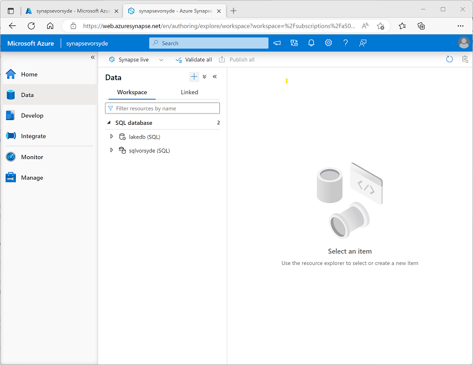
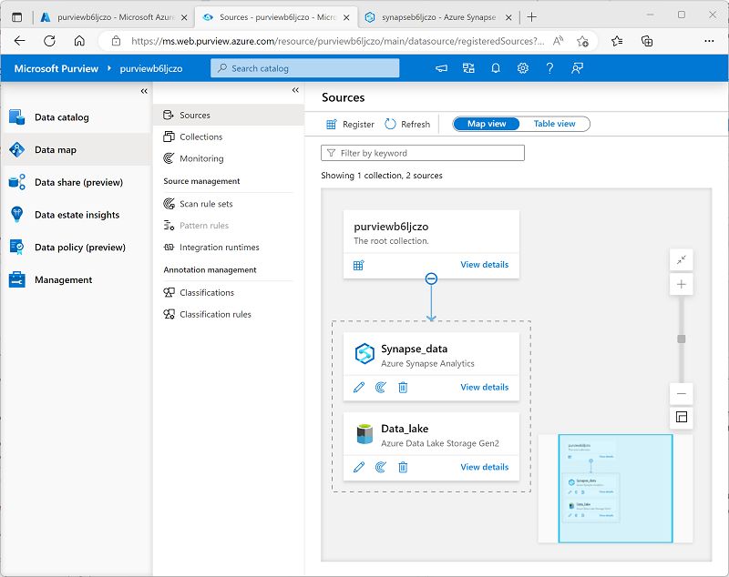

---
lab:
  title: Utiliser Microsoft Purview avec Azure Synapse Analytics
  ilt-use: Lab
---

> **Important** : Microsoft Purview a été mis à jour pour limiter le nombre de comptes Microsoft Purview disponibles par locataire Azure. Par conséquent, ce lab n’est pas pris en charge dans les environnements locataires partagés, y compris de nombreux environnements lab hébergés utilisés dans les cours de formation dirigés par des instructeurs.

# Utiliser Microsoft Purview avec Azure Synapse Analytics

Microsoft Purview vous permet de cataloguer des ressources de données dans votre patrimoine de données, et de suivre le flux de données à mesure qu’elles sont transférées d’une source de données à une autre, ce qui est un élément clé d’une solution de gouvernance des données complète.

Cet exercice devrait prendre environ **40** minutes.

## Avant de commencer

Vous aurez besoin d’un [abonnement Azure](https://azure.microsoft.com/free) dans lequel vous disposez de privilèges de niveau administratif et d’un accès exclusif au locataire dans lequel l’abonnement est défini.

## Approvisionner des ressources Azure

Dans cet exercice, vous allez utiliser Microsoft Purview pour suivre les ressources et la traçabilité des données dans un espace de travail Azure Synapse Analytics. Vous allez commencer par utiliser un script pour approvisionner ces ressources dans votre abonnement Azure.

1. Connectez-vous au [portail Azure](https://portal.azure.com) à l’adresse `https://portal.azure.com`.
2. Utilisez le bouton **[\>_]** à droite de la barre de recherche, en haut de la page, pour créer un environnement Cloud Shell dans le portail Azure, puis sélectionnez un environnement ***PowerShell*** et créez le stockage si vous y êtes invité. Cloud Shell fournit une interface de ligne de commande dans un volet situé en bas du portail Azure, comme illustré ici :

    

    > **Remarque** : si vous avez créé un shell cloud qui utilise un environnement *Bash*, utilisez le menu déroulant en haut à gauche du volet Cloud Shell pour le remplacer par ***PowerShell***.

3. Notez que vous pouvez redimensionner le volet Cloud Shell en faisant glisser la barre de séparation en haut du volet. Vous pouvez aussi utiliser les icônes **&#8212;** , **&#9723;** et **X** situées en haut à droite du volet pour réduire, agrandir et fermer le volet. Pour plus d’informations sur l’utilisation d’Azure Cloud Shell, consultez la [documentation Azure Cloud Shell](https://docs.microsoft.com/azure/cloud-shell/overview).

4. Dans le volet PowerShell, entrez les commandes suivantes pour cloner ce référentiel :

    ```
    rm -r dp-203 -f
    git clone https://github.com/MicrosoftLearning/dp-203-azure-data-engineer dp-203
    ```

5. Une fois le référentiel cloné, entrez les commandes suivantes pour accéder au dossier de ce labo et exécutez le script **setup.ps1** qu’il contient :

    ```
    cd dp-203/Allfiles/labs/22
    ./setup.ps1
    ```

6. Si vous y êtes invité, choisissez l’abonnement que vous souhaitez utiliser (uniquement si vous avez accès à plusieurs abonnements Azure).
7. Lorsque vous y êtes invité, entrez un mot de passe approprié pour votre Azure SQL Database.

    > **Remarque** : veillez à mémoriser ce mot de passe.

8. Attendez que le script se termine. Cela prend généralement environ 15 minutes, mais dans certains cas, cela peut prendre plus de temps. Pendant que vous attendez, examinez l’article [Qu’est-ce qui est disponible dans le portail de gouvernance Microsoft Purview ?](https://docs.microsoft.com/azure/purview/overview) de la documentation Microsoft Purview.

> **Conseil** : Si, après avoir exécuté le script d’installation, vous décidez de ne pas terminer le lab, veillez à supprimer le groupe de ressources **dp203-*xxxxxxx*** créé dans votre abonnement Azure pour éviter des frais Azure inutiles.

## Créer une base de données Lake

Les bases de données Lake stockent des données dans un lac de données sur Stockage Azure. Vous pouvez utiliser des formats Parquet, Delta ou CSV et différents paramètres pour optimiser le stockage. Chaque base de données Lake a un service lié pour définir le dossier de données racines.

Les bases de données Lake sont accessibles dans le pool SQL serverless Synapse SQL et Apache Spark, ce qui permet aux utilisateurs de séparer le stockage du calcul. Les métadonnées de la base de données Lake permettent aux différents moteurs de fournir une expérience intégrée et d’utiliser des informations supplémentaires (telles que des relations) qui n’ont pas été prises en charge sur le lac de données.

1. Pour créer une base de données Lake, commençons par ouvrir le synapsexxxxxxx à partir du groupe de ressources approprié, puis cliquons sur le lien ***Ouvrir*** sur **Ouvrir Synapse Studio**. 
2. Ensuite, nous allons cliquer sur la boîte à outils qui contient la clé, qui est également la section Gérer de l’espace de travail Synapse Analytics, et vérifions que notre pool dédié est en cours d’exécution. Cette opération peut prendre quelques minutes avant de démarrer.
3. À partir de là, nous allons cliquer sur le symbole de base de données qui ressemble à un baril et a une étiquette de données.
4. Une fois dans le panneau Données, cliquez sur le symbole + à droite du mot **Données**, puis sélectionnez ***Base de données Lake***
   
    

> **Remarque** : Vous recevrez une invite **Conditions d’utilisation du modèle de base de données Azure Synapse** que vous devez lire et comprendre avant de cliquer sur le bouton **OK**.

5. Vous remarquerez à l’extrême droite qu’il existe une fenêtre Propriétés.
   1. Tapez **lakedb** dans le champ du nom.
   1. sous **Dossier d’entrée**, sélectionnez le dossier et accédez à la racine/fichiers/données, puis appuyez sur **OK**.

>**Remarque** : Vous verrez probablement une erreur s’afficher lors de l’ouverture de **Dossier d’entrée**. Si c’est le cas, double-cliquez sur le dossier racine et allez jusqu’aux données avant de cliquer sur **OK**.

   1. À gauche de cet écran, vous verrez un pilier portant le nom de votre **lakedb** avec **+Table** en dessous, cliquez dessus, puis sélectionnez ***À partir d’un lac de données***
   1. Sous le ***nom de table externe***, entrez : **Produits**.
   1. Sous ***Service lié***, sélectionnez l’option par défaut.
   1. Dans le ***fichier ou dossier d’entrée*** cliquez sur le dossier ou fichier situé à l’extrême droite et accédez à **racine > fichiers > données >**, puis sélectionnez le ***products.csv***, cliquez sur **OK**, puis sur **Continuer**.

6. Dans le volet **Nouvelle table externe**, sélectionnez l’option Première ligne pour ***déduire les noms de colonnes*** puis cliquez sur **Créer**.


7. Appuyez sur **Publier** dans la partie supérieure de la fenêtre de conception de requête.
8. Sous **Données**, vérifiez que vous êtes dans la zone **Espace de travail** à gauche et développez la section **Base de données Lake**, puis développez **lakedb**. Ensuite, ***passez la souris*** sur le côté droit de la table **Produits** et choisissez ***100 premières lignes***.


> **Remarque** : Vous souhaitez vous assurer que **Se connecter à** est répertorié comme **Intégré** et que vous pouvez laisser la base de données **principale** sélectionnée ou que vous pouvez cliquer sur le bouton Actualiser à droite, puis sélectionner la base de données **lakedb**. Comme cela utilise une convention d’affectation de noms en 3 parties [base de données].[schéma].[table], les deux options fonctionneront.


9. Appuyez sur le bouton **Exécuter** pour afficher les données dans la table de base de données Lake.

## Ajouter le service Microsoft Purview au compte

Microsoft Purview est un portefeuille complet de produits couvrant la gouvernance des données, la protection des informations, la gestion des risques et les solutions de conformité. Cela vous aide à régir, à protéger et à gérer l’ensemble de votre patrimoine de données dans vos données locales, multiclouds et SaaS (logicielles en tant que service)

Pour la configuration, nous allons d’abord revenir à notre groupe de ressources principal nommé dp203-xxxxxxx en fonction du nombre aléatoire que vous avez attribué. Une fois que vous êtes dans le **groupe de ressources**, cliquez sur le bouton ***+ Créer*** pour ajouter un nouveau service.

1. Sélectionnez le **service Microsoft Purview**, puis cliquez sur le bouton **Créer**.
2. Pendant le processus de création, étant donné que vous avez démarré dans le groupe de ressources approprié, il devrait déjà être sélectionné. Ensuite, nous allons donner un nom à **Purview** à l’aide de votre numéro attribué de manière aléatoire. Ensuite, sélectionnez la meilleure région pour votre instance.

   

3. Cliquez sur le bouton **Vérifier et créer**, puis attendez la ***validation*** avant de passer à la suite.

   

4. Une fois la validation effectuée, appuyez sur le bouton **Créer**.

> **Remarque** : Vous devrez peut-être essayer quelques régions pour pouvoir passer la validation avec Purview.

## Cataloguer les ressources de données Azure Synapse Analytics dans Microsoft Purview

Avec Microsoft Purview, vous pouvez cataloguer des ressources de données dans votre patrimoine de données, y compris les sources de données dans un espace de travail Azure Synapse. L’espace de travail que vous venez de déployer inclut un lac de données (dans un compte Azure Data Lake Storage Gen2), une base de données serverless et un entrepôt de données dans un pool SQL dédié.

### Configurer l’accès en fonction du rôle pour Microsoft Purview

Microsoft Purview est configuré pour utiliser une identité managée. Pour cataloguer les ressources de données, ce compte d’identité managée doit avoir accès à l’espace de travail Azure Synapse Analytics et au compte de stockage de son Data Lake Store.

1. Dans le [portail Azure](https://portal.azure.com), accédez au groupe de ressources **dp203-*xxxxxxx*** créé par le script d’installation et affichez les ressources qu’il a créées. Il s’agit notamment des paramètres suivants :
    - Un compte de stockage portant un nom qui ressemble à **datalake*xxxxxxx***.
    - Un compte Microsoft Purview portant un nom qui ressemble à **purview*xxxxxxx***.
    - Un pool SQL dédié avec un nom qui ressemble à **sql*xxxxxxx***.
    - Un espace de travail Synapse portant un nom similaire à **synapse*xxxxxxx***.
2. Ouvrez le compte de stockage **datalake*xxxxxxx*** et, dans sa page **Contrôle d’accès (IAM)**, affichez l’onglet **Attributions de rôles**, comme indiqué ici :

    

3. Dans le menu du bouton **+ Ajouter**, sélectionnez **Ajouter une attribution de rôle**. 
4. Dans la page **Ajouter une attribution de rôle**, sous l’onglet **Rôle**, recherchez « objet blob de stockage » et sélectionnez le rôle **Lecteur des données blob du stockage**. Sélectionnez ensuite **Suivant** pour accéder à l’onglet **Membres** :

    

5. Sous l’onglet **Membres**, dans la liste **Attribuer l’accès à**, sélectionnez **Identité managée**, puis, sous **Membres**, sélectionnez **Sélectionner des membres**.
6. Dans le volet **Sélectionner des identités managées**, dans la liste **Identité managée**, sélectionnez **Compte Microsoft Purview (*n*)** et sélectionnez votre compte Microsoft Purview dont le nom devrait ressembler à **purview*xxxxxxx***, et utilisez le bouton **Sélectionner** pour ajouter ce compte à l’attribution de rôle :

    

7. Utilisez le bouton **Vérifier + Attribuer** pour terminer l’attribution de rôle, ce qui fait du compte **purview*xxxxxxx*** utilisé par l’identité managée pour votre ressource Microsoft Purview, un membre du rôle **Lecteur des données blob du stockage** pour votre compte de stockage.
8. Dans le portail Azure, revenez au groupe de ressources **dp203-*xxxxxxx*** et ouvrez l’espace de travail Synapse Analytics **synapse*xxxxxxx***. Ensuite, dans sa page **Contrôle d’accès (IAM)**, ajoutez une attribution de rôle pour faire du compte d’identité managée **purview*xxxxxxx*** un membre du rôle **Lecteur** dans l’espace de travail.

### Configurer des autorisations de base de données pour Microsoft Purview

Votre espace de travail Azure Synapse Analytics inclut des bases de données dans des pools SQL *serverless* et *dédiés*, auxquels l’identité managée utilisée par Microsoft Purview nécessite un accès.

1. Dans le portail Azure, dans la page de votre espace de travail Synapse Analytics, affichez l’onglet **Vue d’ensemble**. Ensuite, dans la vignette **Ouvrir Synapse Studio**, utilisez le lien pour ouvrir Azure Synapse Studio dans un nouvel onglet de navigateur, en vous connectant si vous y êtes invité.

    >**Conseil** : Vous pouvez également ouvrir Azure Synapse Studio en accédant directement à https://web.azuresynapse.net dans un nouvel onglet de navigateur.

2. Sur le côté gauche de Synapse Studio, utilisez l’icône **&rsaquo;&rsaquo;** pour développer le menu. Cela permet d’afficher les différentes pages de Synapse Studio.
3. Sur la page **Gérer**, sous l’onglet **Pools SQL**, sélectionnez la ligne du pool SQL dédié **sql*xxxxxxx*** et utilisez l’icône **▷** correspondante pour le démarrer. Confirmez si vous souhaitez le reprendre lorsque vous y êtes invité.

    

4. Attendez que le pool SQL se réactive. Cette opération peut prendre quelques minutes. Vous pouvez utiliser le bouton **↻ Actualiser** pour vérifier régulièrement son statut. Le statut **En ligne** apparaît lorsqu’il est prêt.
5. Dans Azure Synapse Studio, affichez la page **Données** et, dans l’onglet **Espace de travail**, développez **Base de données SQL** pour afficher les bases de données dans votre espace de travail. Il devrait y avoir :
    - Une base de données de pool SQL serverless nommée **lakedb**.
    - Une base de données de pool SQL dédiée nommée **sql*xxxxxxx***.

    

6. Sélectionnez la base de données **lakedb**, puis, dans son menu **...**, sélectionnez **nouveau script SQL** > **Script vide** pour ouvrir un nouveau volet **Script SQL 1**. Vous pouvez utiliser le bouton **Propriétés** (qui ressemble à **&#128463;<sub>*</sub>**) situé à droite de la barre d’outils pour masquer le volet **Propriétés** et afficher plus facilement le volet script.
7. Dans le volet **script SQL 1**, entrez le code SQL suivant, en remplaçant toutes les instances de ***purviewxxxxxxx*** par le nom d’identité managée de votre compte Microsoft Purview :

    ```sql
    CREATE LOGIN purviewxxxxxxx FROM EXTERNAL PROVIDER;
    GO

    CREATE USER purviewxxxxxxx FOR LOGIN purviewxxxxxxx;
    GO

    ALTER ROLE db_datareader ADD MEMBER purviewxxxxxxx;
    GO
    ```

8. Utilisez le bouton **&#9655; Exécuter** pour exécuter le script, qui crée une connexion dans le pool serverless et un utilisateur dans l’utilisateur **lakedb** pour l’identité managée utilisée par Microsoft Purview, et ajoute l’utilisateur au rôle **db_datareader** dans la base de données **lakedb**.
9. Créez un script vide pour la base de données de pool SQL dédié **sql*xxxxxxx*** et utilisez-le pour exécuter le code SQL suivant (en remplaçant ***purviewxxxxxxx*** par le nom d’identité managée de votre compte Microsoft Purview). Cela crée un utilisateur dans le pool SQL dédié pour l’identité managée utilisée par Microsoft Purview et l’ajoute au rôle **db_datareader** dans la base de données **sql*xxxxxxx***.

    ```sql
    CREATE USER purviewxxxxxxx FROM EXTERNAL PROVIDER;
    GO

    EXEC sp_addrolemember 'db_datareader', purviewxxxxxxx;
    GO
    ```

### Inscrire des sources dans le catalogue Microsoft Purview

Maintenant que vous avez configuré l’accès requis pour Microsoft Purview pour analyser les sources de données utilisées par votre espace de travail Azure Synapse Analytics, vous pouvez les inscrire dans votre catalogue Microsoft Purview.

1. Revenez à l’onglet du navigateur contenant le portail Azure et affichez la page du groupe de ressources **dp203-*xxxxxxx***.
2. Ouvrez le compte Microsoft Purview **purview*xxxxxxx*** et, dans sa page **Vue d’ensemble**, utilisez le lien pour ouvrir le **portail de gouvernance Microsoft Purview** dans un nouvel onglet du navigateur. Connectez-vous si vous y êtes invité.

    >**Conseil** : Vous pouvez également accéder directement à https://web.purview.azure.com dans un nouvel onglet de navigateur.

3. Sur le côté gauche du portail de gouvernance Azure Purview, utilisez l’icône **&rsaquo;&rsaquo;** pour développer le menu. Cela révèle les différentes pages du portail.
4. Dans la page **Mappage des données**, dans la sous-page **Sources**, sélectionnez **Inscrire** :

    

5. Dans l’onglet **Inscrire des sources** qui s’affiche, sélectionnez **Azure Synapse Analytics** et continuez à inscrire une source avec les paramètres suivants :
    - **Nom** : Synapse_data
    - **Abonnement Azure** : *sélectionnez votre abonnement Azure.*
    - **Nom de l’espace de travail** : *Sélectionner votre espace de travail **synapsexxxxxxx***
    - **Point de terminaison SQL dédié** : sql*xxxxxxx*.sql.azuresynapse.net
    - **Point de terminaison SQL serverless** : sql*xxxxxxx*-ondemand.sql.azuresynapse.net
    - **Sélectionner une collection** : Racine (purview*xxxxxxx*)

    Cette source de données inclut les bases de données SQL dans votre espace de travail Azure Synapse Analytics.

6. Après avoir inscrit la source **Synapse_data**, sélectionnez **Réinscrire**, puis inscrivez une deuxième source pour le stockage Data Lake Storage utilisé par votre espace de travail Azure Synapse. Sélectionnez **Azure Data Lake Storage Gen2** et spécifiez les paramètres suivants :
    - **Nom** : Data_lake
    - **Abonnement Azure** : *sélectionnez votre abonnement Azure.*
    - **Nom de l’espace de travail** : *Sélectionnez votre compte de stockage **datalakexxxxxxx***
    - **Point de terminaison** : https:/ /datalakexxxxxxx.dfs.core.windows.net/
    - **Sélectionner une collection** : Racine (purview*xxxxxxx*)
    - **Gestion des données** : Désactivé

    Après avoir inscrit les sources **Synapse_data** et **Data_lake**, elles doivent toutes deux être affichées sous la collection racine **purview*xxxxxxx*** dans le mappage des données, comme indiqué ici :

    

### Analyser les sources inscrites

1. Dans le mappage de données, dans la source **Synapse_data**, sélectionnez **Afficher les détails** et constatez que la source n’a pas de ressources cataloguées. Vous devez analyser la source pour rechercher les ressources de données qu’elle contient.
2. Dans la page de détails **Synapse_data**, sélectionnez **Nouvelle analyse**, puis configurez une analyse avec les paramètres suivants :
    - **Nom** : Scan-Synapse
    - **Se connecter à un runtime d’intégration** : Azure AutoresolveIntegrationRuntime
    - **Type** : SQL Database
    - **Credential** : Microsoft Purview MSI (système)
    - **SQL Database** : *Sélectionner la base de données dédiée **sqlxxxxxxx** <u>et</u> la base de données serverless **lakedb**.*
    - **Sélectionner une collection** : Racine (purview*xxxxxxx*)

    

3. Passez à la page **Sélectionner un jeu de règles d’analyse**, sur laquelle l’ensemble de règles par défaut **AzureSynapseSQL** doit être sélectionné.
4. Passez à la page **Définir un déclencheur d’analyse**, puis sélectionnez **Une fois** pour exécuter l’analyse une seule fois.
4. Passez à la page **Passez en revue votre analyse**, puis enregistrez et exécutez l’analyse.
6. Pendant que l’analyse **Synapse_data** est en cours d’exécution, revenez à la page **Sources** pour afficher le mappage de données et, dans la source **Data_lake**, utilisez l’icône **Nouvelle analyse** pour démarrer une analyse du lac de données avec les paramètres suivants :
    - **Nom** : Scan-Data-Lake
    - **Se connecter à un runtime d’intégration** : Azure AutoresolveIntegrationRuntime
    - **Credential** : Microsoft Purview MSI (système)
    - **Sélectionner une collection** : Racine (purview*xxxxxxx*)
    - **Étendue de l’analyse** : *Sélectionnez **Data_lake** et toutes les sous-ressources* 
    - **Sélectionnez un ensemble de règles pour l’analyse** :  AdlsGen2
    - **Définissez un déclencheur d’analyse** : Une fois
    - **Vérifiez votre analyse**, enregistrez et exécutez
7. Attendez que les deux analyses se terminent. Cela peut prendre plusieurs minutes. Vous pouvez afficher la page de détails de chacune des sources pour afficher l’**État de la dernière exécution**, comme indiqué ci-dessous (vous pouvez utiliser le bouton **&#8635; Actualiser** pour mettre à jour l’état). Vous pouvez également afficher la page **surveillance** (bien que les analyses peuvent prendre un certain temps avant de s’afficher) :

    

### Afficher les ressources analysées

1. Dans la page **Catalogue de données**, dans la sous-page **Parcourir**, sélectionnez la collection **purview*xxxxxxx***. Ici, vous pouvez voir les ressources de données qui ont été cataloguées dans votre espace de travail Azure Synapse et le stockage Data Lake Storage, notamment l’espace de travail Azure Synapse Analytics, le compte stockage Azure pour le lac de données, les deux bases de données de pool SQL dans Azure Synapse Analytics, le schéma **dbo** dans chaque base de données, les tables et les vues dans les bases de données, et les dossiers et fichiers dans le lac de données.
2. Pour filtrer les résultats, dans la liste **Limiter les résultats par** de types d’objets, sélectionnez **Fichiers** et **Tables** afin que seuls les fichiers, tables et affichages qui ont été catalogués par l’analyse soient répertoriés :

    

    Notez que les ressources de données sont les suivantes :

    - **products** : une table du pool SQL dédié pour les données de produit.
    - **products.csv** : un fichier dans le lac de données.
    - **products_csv** : vue dans le pool SQL serverless qui lit les données de produit à partir du fichier *products.csv*.

3. Explorez les ressources trouvées en les sélectionnant et en affichant leurs propriétés et leur schéma. Vous pouvez modifier les propriétés des ressources (y compris les champs individuels) pour ajouter des métadonnées, des catégorisations, des coordonnées pour les experts concernées et d’autres détails utiles afin que les analystes de données puissent trouver beaucoup d’informations sur les ressources de données de votre patrimoine de données en les explorant dans le catalogue de données Microsoft Purview.

Jusqu’à présent, vous avez utilisé Microsoft Purview pour cataloguer les ressources de données dans votre espace de travail Azure Synapse Analytics. Vous pouvez inscrire plusieurs types de sources de données dans un catalogue Microsoft Purview, ce qui vous permet de créer une vue centralisée et consolidée des ressources de données.

Nous allons maintenant explorer d’autres façons d’intégrer Azure Synapse Analytics et Microsoft Purview.

## Intégrer Microsoft Purview avec Azure Synapse Analytics

Azure Synapse Analytics prend en charge l’intégration à Microsoft Purview pour rendre les ressources de données détectables et suivre la traçabilité des données via des pipelines d’ingestion qui transfèrent des données d’une source à une autre.

### Activer l’intégration de Microsoft Purview dans Azure Synapse Analytics

1. Revenez à l’onglet du navigateur contenant Synapse Studio, puis, dans la page **Gérer**, sélectionnez l’onglet **Microsoft Purview**, puis utilisez le bouton **Se connecter à un compte Purview** pour connecter le compte **purview*xxxxxxx*** de votre abonnement à l’espace de travail.
2. Après avoir connecté le compte, affichez l’onglet **Compte Purview** pour vérifier si **Traçabilité des données – Pipeline Synapse** dans le compte est en état **Connecté** :

    

### Rechercher dans le catalogue Purview dans Synapse Studio

Maintenant que vous avez connecté votre compte Microsoft Purview à votre espace de travail Azure Synapse Analytics, vous pouvez effectuer une recherche dans le catalogue à partir de Synapse Studio, ce qui vous permet de découvrir des ressources de données dans votre patrimoine de données.

1. Dans Synapse Studio, affichez la page **Intégrer**.
2. Dans la partie supérieure de la page, utilisez la zone **Rechercher** en haut pour rechercher la source **Purview** pour le terme « produits », comme illustré ici :

    

3. Dans les résultats, sélectionnez **products.csv** pour afficher ses détails dans le catalogue Purview.

En intégrant le catalogue Purview à l’interface Synapse Studio, les analystes de données et les ingénieurs peuvent rechercher et examiner les ressources de données inscrites dans l’ensemble du patrimoine de données (pas seulement dans l’espace de travail Azure Synapse Studio).

### créer et exécuter un pipeline

L’affichage **products_csv** dans la base de données **lakedb** est basé sur un fichier texte dans le lac de données qui contient des données de produit. La table **products** dans la base de données SQL dédiée **sql*xxxxxxx*** est actuellement vide. Utilisons un pipeline Synapse pour charger des données du lac de données dans la table.

1. Dans Synapse Studio, dans la page **Intégrer**, dans le menu **+**, sélectionnez **Outil Copier des données**.
2. Dans l’outil Copier des données, sélectionnez **Tâche de copie intégrée**, puis **Exécuter une fois**, puis sélectionnez **Suivant**.
3. Dans la page **Magasin de données source**, dans la liste **Connexion** sélectionnez la connexion **synapse*xxxxxxx*-WorkspaceDefaultStorage** (qui fait référence au lac de données de l’espace de travail) et pour le **Fichier ou dossier**, accédez au fichier **fichiers/produits/products.csv**. Sélectionnez ensuite **Suivant**.
4. Dans la page **Paramètres de format de fichier**, sélectionnez **Détecter le format de texte**. Vérifiez ensuite que les paramètres suivants sont spécifiés avant de sélectionner **Suivant** :
    - **Format de fichier** : DelimitedText
    - **Séparateur de colonne** : virgule (,)
    - **Délimiteur de lignes** : Saut de ligne (\n)
    - **Première ligne comme en-tête** : Sélectionné
    - **Type de compression** : Aucune
5. Dans la page **Magasin de données de destination**, dans la liste **Connexion**, sélectionnez **sql*xxxxxxx*** (la connexion à votre pool SQL dédié). Définissez ensuite la cible sur la table **dbo.products** existante, puis sélectionnez **Suivant**.
6. Dans la page **Mappage de colonnes**, passez en revue les mappages de colonnes par défaut, puis sélectionnez **Suivant**.
7. Dans la page **Paramètres**, définissez **Nom de la tâche** sur **Load_Product_Data**. Sélectionnez ensuite la méthode de copie **Insertion en bloc**, puis sélectionnez **Suivant**.
8. Dans la page **Synthèse**, sélectionnez **Suivant**.
9. Attendez que le pipeline soit déployé, puis sélectionnez **Terminer**.
10. Dans Synapse Studio, affichez la page **Surveiller**. Ensuite, sous l’onglet **Exécutions de pipeline**, observez l’état du pipeline **Load_Product_Data**. L’état peut prendre quelques minutes avant de passer à **Réussi**.
11. Une fois l’exécution du pipeline terminée, sélectionnez son nom (**Load_Product_Data**) pour afficher les détails des activités dans le pipeline, et constatez que le pipeline inclut une tâche **Copier des données** avec un nom dérivé automatiquement qui ressemble à **Copy_* xxx***. Cette activité a copié les données du fichier texte dans le lac de données dans la table **products** dans la base de données **sql*xxxxxxx***.

### Afficher la traçabilité des données dans Microsoft Purview

Vous avez utilisé un pipeline Synapse pour charger des données dans une base de données. Vérifions que cette activité a été suivie dans Microsoft Purview.

1. Basculez vers l’onglet du navigateur contenant le portail de gouvernance Microsoft Purview.
2. Dans la page **Catalogue de données**, dans la sous-page **Parcourir**, sélectionnez la collection **purview*xxxxxxx***.
3. Filtrez les ressources pour afficher uniquement **Pipelines de données**, **Fichiers** et **Tables**. La liste des ressources doit inclure le fichier **products.csv**, l’activité de pipeline **Copy_*xxx*** et la table **products**.
4. Sélectionnez la ressource **Copy_*xxx*** pour afficher ses détails, et remarquez que l’**heure mise à jour** reflète l’exécution récente du pipeline.
5. Sous l’onglet **Traçabilité** de la ressource **Copy_*xxx***, affichez le diagramme montrant le flux de données du fichier **products.csv** vers la table **products** :

    

6. Dans le diagramme de traçabilité **Copy_*xxx***, sélectionnez le fichier **products.csv** et utilisez son lien **Basculer vers la ressource** pour afficher les détails du fichier source.
7. Dans le diagramme de traçabilité **products.csv**, sélectionnez la table **products** et utilisez son lien **Basculer vers la ressource** pour afficher les détails de la table (vous devrez peut-être utiliser le bouton **&#8635; Actualiser** pour afficher le diagramme de traçabilité de table).

La fonctionnalité de suivi de traçabilité activée en intégrant Azure Synapse Analytics à Microsoft Purview vous permet de déterminer comment et quand les données de vos magasins de données ont été chargées et à partir duquel elles proviennent.

> **Conseil** : Dans cet exercice, vous avez vu les informations de traçabilité dans le portail de gouvernance Microsoft Purview, mais n’oubliez pas que les mêmes ressources peuvent également être consultées dans Synapse Studio via la fonctionnalité d’intégration de recherche.

### Suspendre le pool SQL dédié

1. Revenez à l’onglet Synapse Studio et, dans la page **Gérer**, suspendez le pool SQL dédié **sql*xxxxxxx***.

## Supprimer les ressources Azure

Si vous avez fini d’explorer Azure Synapse Analytics, vous devriez supprimer les ressources que vous avez créées afin d’éviter des coûts Azure inutiles.

1. Fermez l’onglet du navigateur Synapse Studio et revenez dans le portail Azure.
2. Dans le portail Azure, dans la page **Accueil**, sélectionnez **Groupes de ressources**.
3. Sélectionnez le groupe de ressources **dp203-*xxxxxxx*** pour votre espace de travail Synapse Analytics (et non le groupe de ressources managé) et vérifiez qu’il contient l’espace de travail Synapse, le compte de stockage et le pool SQL dédié Spark pour votre espace de travail.
4. Au sommet de la page **Vue d’ensemble** de votre groupe de ressources, sélectionnez **Supprimer le groupe de ressources**.
5. Entrez le nom du groupe de ressources **dp203-*xxxxxxx*** pour confirmer que vous souhaitez le supprimer, puis sélectionnez **Supprimer**.

    Après quelques minutes, le groupe de ressources de l’espace de travail Azure Synapse et le groupe de ressources managé de l’espace de travail qui lui est associé seront supprimés.
